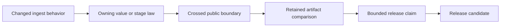

# Release Acceptance

An ingest change is releasable when the prepared corpus remains identifiable,
ordered, inspectable, and honest about partial failure. Passing transformation
tests alone is insufficient when the change also affects a public envelope,
persisted index, citation span, or retrieval claim.

## Acceptance record

| Changed surface | Required evidence | Release-blocking result |
| --- | --- | --- |
| cleaning or source identity | normalized-text fixtures, repeated identity comparison, and source metadata | equivalent configuration produces unexplained identity drift |
| chunking or tail policy | span, overlap, ordering, and boundary fixtures | a citation cannot be resolved against the retained normalized text |
| embedding contract | model and dimension validation plus adapter identity | vectors are accepted without a compatible `EmbeddingSpec` |
| streaming or concurrency | ordering, termination, backpressure, and partial-failure evidence | loss or duplication can be reported as complete success |
| deduplication | structural-key and stable-order fixtures | winner selection depends on incidental iteration order |
| persisted index or cache | round trip, version mismatch, and stale-state rejection | incompatible state is silently reused |
| CLI or HTTP envelope | focused interface test, schema drift check, and error mapping | an adapter changes domain success or failure meaning |
| retrieval-quality claim | checked-in corpus, metric output, configuration, and model identity | a deterministic hash baseline is presented as semantic quality |

## Evidence custody

Keep the input identifiers, normalization and chunking configuration, produced
chunk records, embedding specification, observations, errors, and evaluation
summary together. A final count or saved index without its preparation
configuration cannot explain later ranking or citation drift.

Expected failures remain part of the acceptance record. Rejected documents,
truncated streams, breaker openings, and retry exhaustion must retain stage,
position, cause, and termination status rather than disappearing into an empty
result.

## Release decision

Acceptance is package-specific and claim-specific:

- transformation evidence supports deterministic preparation claims;
- persistence evidence supports round-trip and compatibility claims;
- offline evaluation supports only the recorded corpus, model, and metrics;
- none of these establishes source accuracy, licensing, or deployment safety.

Use [change validation](change-validation.md) to select the narrowest checks and
[known limitations](known-limitations.md) to preserve unsupported boundaries in
the release description.
