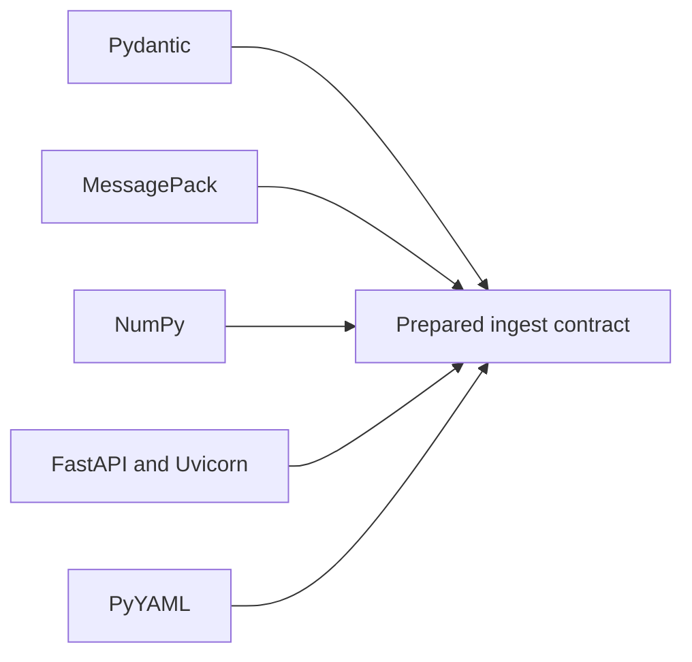

# Dependency Authority

Every ingest dependency joins a different part of the trust boundary. Version
compatibility is necessary, but the decisive question is which package may
change data identity, numerical output, serialization, or network behavior.

## Production dependencies

| Dependency boundary | Authority introduced | Evidence required when it changes |
| --- | --- | --- |
| Pydantic | validation, coercion, strict-field, and serialization behavior | invalid/extra-field matrix and stable envelope snapshots |
| MessagePack | binary representation and persisted-index decoding | round trip, corrupt input, and incompatible-envelope rejection |
| NumPy | vector representation, dtype, dimensions, and numerical operations | dimension/metric tests and repeated deterministic fixtures |
| FastAPI and Uvicorn | HTTP validation, error translation, schema, and serving behavior | OpenAPI drift, request/response contracts, and failure mapping |
| PyYAML | configuration parsing and scalar interpretation | valid/invalid configuration fixtures and resolved-value comparison |

An optional embedder, reader, storage adapter, or caller-provided stage adds
its own version and semantics even when it is not a declared core dependency.
Record that identity with outputs used for comparison or replay.

## Boundary rules

- A codec upgrade must not silently reinterpret an existing saved index.
- A validation upgrade must not widen accepted input without an explicit
  contract decision.
- A numerical upgrade requires comparison of vector and ranking behavior, not
  only import success.
- An HTTP upgrade requires the checked-in schema and live application behavior
  to agree.
- Retrieval-provider and governed-backend dependencies belong in
  `bijux-canon-index` when they own capability negotiation or replay policy.

Dependency locks and audit reports establish resolved versions and known
advisories. They do not establish semantic compatibility. The corresponding
domain, persistence, interface, or evaluation evidence closes that gap.

Use [test strategy](test-strategy.md) to locate the owning suites and
[risk register](risk-register.md) to assess residual model, codec, and service
exposure.
