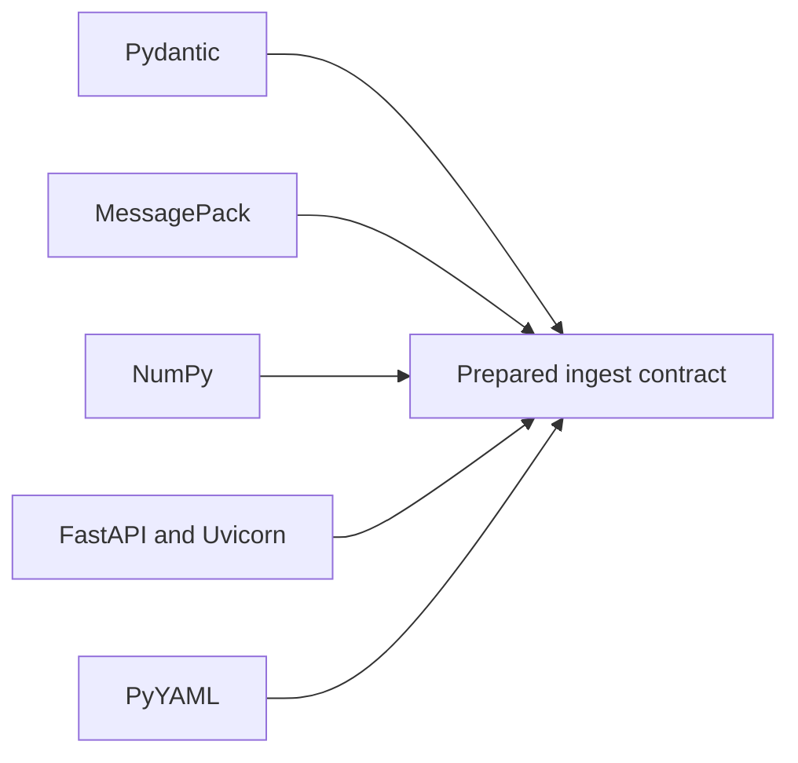

# Dependency Authority

Every ingest dependency joins a different part of the trust boundary. Version
compatibility is necessary, but the decisive question is which package may
change data identity, numerical output, serialization, or network behavior.

## Production dependencies

| Dependency boundary | Authority introduced | Evidence required when it changes |
| --- | --- | --- |
| Pydantic | validation, coercion, strict-field, and serialization behavior | invalid/extra-field matrix and stable envelope snapshots |
| MessagePack | binary representation and persisted-index decoding | round trip, corrupt input, and incompatible-envelope rejection |
| NumPy | vector representation, dtype, dimensions, and numerical operations | dimension/metric tests and repeated deterministic fixtures |
| FastAPI and Uvicorn | HTTP validation, error translation, schema, and serving behavior | OpenAPI drift, request/response contracts, and failure mapping |
| PyYAML | configuration parsing and scalar interpretation | valid/invalid configuration fixtures and resolved-value comparison |

An optional embedder, reader, storage adapter, or caller-provided stage adds
its own version and semantics even when it is not a declared core dependency.
Record that identity with outputs used for comparison or replay.

## Boundary rules

- A codec upgrade must not silently reinterpret an existing saved index.
- A validation upgrade must not widen accepted input without an explicit
  contract decision.
- A numerical upgrade requires comparison of vector and ranking behavior, not
  only import success.
- An HTTP upgrade requires the checked-in schema and live application behavior
  to agree.
- Retrieval-provider and governed-backend dependencies belong in
  `bijux-canon-index` when they own capability negotiation or replay policy.

Dependency locks and audit reports establish resolved versions and known
advisories. They do not establish semantic compatibility. The corresponding
domain, persistence, interface, or evaluation evidence closes that gap.

## Admit a dependency change

Use the same representative corpus before and after resolution. The review
record should contain the old and new lock identity, Python and platform
identity, enabled extras, configuration, source hashes, output artifacts,
failures, and a classified comparison. Compare at the boundary the dependency
owns:

| Change | Required comparison | Acceptable outcome |
| --- | --- | --- |
| Pydantic | accepted and rejected models, extra fields, defaults, canonical serialization, public errors | intentional contract differences are named; stable inputs keep their meaning |
| MessagePack | old artifact read, new artifact round trip, corrupt and unsupported envelope | prior supported artifacts remain readable or fail with an explicit compatibility decision |
| NumPy | shape, dtype, finite values, fingerprints, repeated vector and ranking fixtures | exact or tolerance-bounded change is declared before results are inspected |
| FastAPI or Uvicorn | checked-in OpenAPI, live request/response matrix, status, body, headers, streaming and exception paths | schema and observed behavior agree at every supported operation |
| PyYAML | booleans, nulls, numbers, strings, aliases, duplicate/unknown fields, and resolved configuration | ambiguous input is refused or resolves identically under the documented configuration contract |
| model or caller adapter | model/assets digest, adapter version, parameters, output/failure distribution, cache and network posture | new authority is explicit and downstream identity changes with it |

A checksum change is a signal, not automatically a regression. Classify each
difference as contract-preserving, intentionally contract-changing,
tolerance-bounded, or unacceptable. Do not update a golden artifact until the
classification and its owner are recorded.

## Separate package, asset, and service identity

The Python lock identifies installed distributions; it does not identify a
downloaded model, mutable cache entry, remote endpoint, or caller-owned
adapter. When any of those participate in preparation, retain their own
immutable identity and availability/failure evidence beside the ingest
artifact. A package upgrade that leaves the lock review clean can still change
output because a model revision or remote service changed independently.

Use [test strategy](test-strategy.md) to locate the owning suites and
[risk register](risk-register.md) to assess residual model, codec, and service
exposure.
