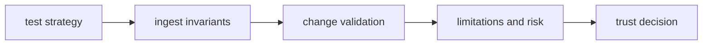

# Quality

Open this section when you need to decide whether prepared ingest output is trustworthy enough for downstream packages to build on without inheriting hidden drift.

## Trust Model

Quality pages should tell a reviewer why prepared ingest output deserves to be
trusted by later packages. Tests matter, but only when they are connected to
the invariants that keep source preparation stable and to the limits that still
need to be read honestly.

## Read These First

- open [Test Strategy](https://bijux.io/bijux-canon/02-bijux-canon-ingest/quality/test-strategy/) first when you need the broad proof shape behind ingest behavior
- open [Invariants](https://bijux.io/bijux-canon/02-bijux-canon-ingest/quality/invariants/) when the question is what must not drift across source preparation and chunking
- open [Change Validation](https://bijux.io/bijux-canon/02-bijux-canon-ingest/quality/change-validation/) when you need the minimum proof for a safe ingest change

## Trust Risk

The main quality risk here is letting unstable prepared input look healthy because later packages still pass on top of it.

## First Proof Check

- `tests` and package-local validation surfaces for executable evidence
- invariants, limitations, and risk pages for the trust boundaries that still matter after green checks
- release notes and caller-facing docs when the change alters what readers may safely assume

## Pages In This Section

- [Test Strategy](https://bijux.io/bijux-canon/02-bijux-canon-ingest/quality/test-strategy/)
- [Invariants](https://bijux.io/bijux-canon/02-bijux-canon-ingest/quality/invariants/)
- [Review Checklist](https://bijux.io/bijux-canon/02-bijux-canon-ingest/quality/review-checklist/)
- [Documentation Standards](https://bijux.io/bijux-canon/02-bijux-canon-ingest/quality/documentation-standards/)
- [Definition of Done](https://bijux.io/bijux-canon/02-bijux-canon-ingest/quality/definition-of-done/)
- [Dependency Governance](https://bijux.io/bijux-canon/02-bijux-canon-ingest/quality/dependency-governance/)
- [Change Validation](https://bijux.io/bijux-canon/02-bijux-canon-ingest/quality/change-validation/)
- [Known Limitations](https://bijux.io/bijux-canon/02-bijux-canon-ingest/quality/known-limitations/)
- [Risk Register](https://bijux.io/bijux-canon/02-bijux-canon-ingest/quality/risk-register/)

## Leave This Section When

- leave for [Foundation](https://bijux.io/bijux-canon/02-bijux-canon-ingest/foundation/) when the doubt is really about package ownership rather than proof
- leave for [Interfaces](https://bijux.io/bijux-canon/02-bijux-canon-ingest/interfaces/) when the question is what the contract is rather than whether it is defended
- leave for [Operations](https://bijux.io/bijux-canon/02-bijux-canon-ingest/operations/) when the package already seems trustworthy and the real issue is how to run it repeatably

## Design Pressure

If quality here is reduced to green checks alone, unstable prepared input can
still leak forward. This section has to tie proofs, invariants, and residual
limits into one trust story.
