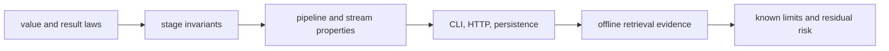

# Quality

Trust in ingest begins with stable value laws and ends with a retrieval output
whose identity, configuration, and citations can be inspected. Green interface
tests cannot compensate for drift in normalization, chunk identity, ordering,
or embedding semantics.

## Evidence chain

```mermaid
flowchart LR
    values["value and result laws"]
    stages["stage invariants"]
    composition["pipeline and stream properties"]
    boundaries["CLI, HTTP, persistence"]
    evaluation["offline retrieval evidence"]
    limits["known limits and residual risk"]

    values --> stages --> composition --> boundaries --> evaluation --> limits
```

## Claims and proof

| Trust claim | Focused evidence | Residual limit |
| --- | --- | --- |
| records reject invalid shape | core, result, and public-model unit tests | validity does not establish source truth |
| cleaning and chunking are deterministic | processing tests plus identity/span invariants | caller-supplied stages join the determinism boundary |
| lazy execution preserves order and termination | streaming, scheduling, backpressure, and property tests | materialized observations can scale with corpus size |
| deduplication is stable | rule and pipeline tests over structural keys | semantic duplicates remain distinct |
| resilience is bounded and visible | retry, breaker, resource, cache, and effect tests | policies work only where explicitly composed |
| public surfaces preserve domain meaning | strict-model, serialization, CLI, HTTP, and schema tests | deployment state and security remain application concerns |
| local retrieval behaves as declared | persisted-index and deterministic evaluation tests | hash embeddings do not prove semantic quality |
| answers retain usable citations | truthfulness gate and answer-path tests | citation presence does not prove source authority |

## High-risk changes

Changes to normalization, spans, chunk identity, ordering, deduplication,
embedding dimensions, persisted index format, citation linkage, or error
translation require evidence at the owning layer and at every public boundary
they cross. External-model changes also require model-specific evaluation; the
deterministic hash profile is not a proxy.

## Evidence routes

| Need | Guide |
| --- | --- |
| Understand the suite by ownership layer | [Test strategy](test-strategy.md) |
| Review non-negotiable value and pipeline laws | [Invariants](invariants.md) |
| Select evidence for a proposed change | [Change validation](change-validation.md) |
| Review a change consistently | [Review checklist](review-checklist.md) |
| Decide whether work is complete | [Definition of done](definition-of-done.md) |
| Evaluate optional and core dependencies | [Dependency governance](dependency-governance.md) |
| Understand claims the package cannot make | [Known limitations](known-limitations.md) |
| Inspect unresolved failure modes | [Risk register](risk-register.md) |
| Interpret preparation artifacts without overstating their guarantee | [Interpreting preparation evidence](evidence-interpretation.md) |

The appropriate proof is proportional and local: begin with the invariant that
owns the behavior, add the crossed boundary, and use corpus evaluation only for
retrieval-quality claims.
