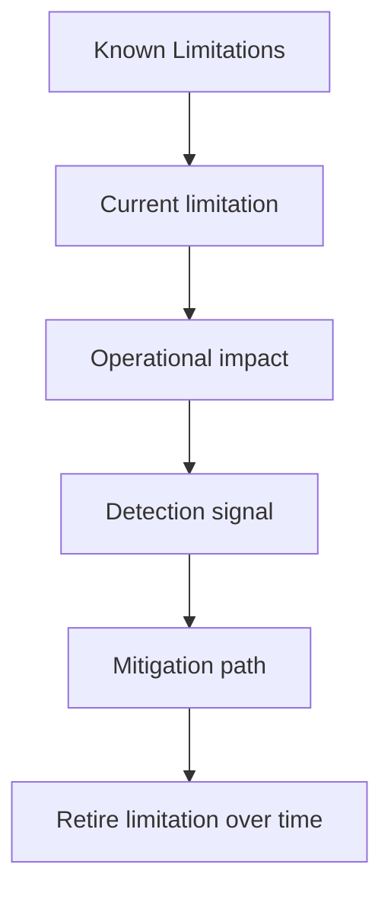

# Known Limitations

No package is improved by pretending its limitations do not exist.

This page protects credibility by keeping the current limits visible. Readers
should be able to tell what the package does not promise without mining issue
threads or learning the hard way in production.

Treat the quality pages for `bijux-canon-ingest` as the proof frame around the package. They should show how trust is earned and where skepticism still belongs.

## Visual Summary

## Honest Boundaries

- runtime-wide replay authority and persistence
- cross-package vector execution semantics
- repository maintenance automation

## Concrete Anchors

- tests/unit for module-level behavior across processing, retrieval, and interfaces
- tests/e2e for package boundary coverage
- README.md

## Use This Page When

- you are reviewing tests, invariants, limitations, or ongoing risks
- you need evidence that the documented contract is actually defended
- you are deciding whether a change is truly done rather than merely implemented

## Decision Rule

Use `Known Limitations` to decide whether `bijux-canon-ingest` has actually earned trust after a change. If one narrow green check hides a wider contract, risk, or validation gap, the work is not done yet.

## What This Page Answers

- what currently proves the `bijux-canon-ingest` contract instead of merely describing it
- which risks, limits, and assumptions still need explicit skepticism
- what a reviewer should be able to say before accepting a change as done

## Reviewer Lens

- compare the documented proof story with the actual test layout and release posture
- look for limitations or risks that should have moved with recent behavior changes
- verify that the claimed done-ness standard still reflects real validation practice

## Honesty Boundary

This page explains how `bijux-canon-ingest` is supposed to earn trust, but it does not claim that prose alone is enough. If the listed tests, checks, and review practice stop backing the story, the story has to change.

## Next Checks

- move to foundation when the risk appears to be boundary confusion rather than missing tests
- move to architecture when the proof gap points to structural drift
- move to interfaces or operations when the proof question is really about a contract or workflow

## Purpose

This page keeps limitation language attached to the package boundary instead of scattered through issue comments.

## Stability

Keep it aligned with the limitations that remain intentionally true today.
