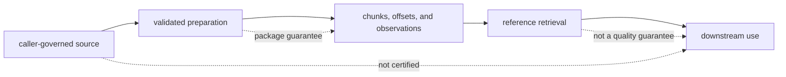

# Known Limitations

`bijux-canon-ingest` makes preparation behavior explicit and inspectable. It
does not certify the source material, provide distributed delivery semantics,
or make an external embedding service reproducible. The distinction matters:
a deterministic transform can faithfully preserve a bad or unauthorized
source.

## Supported Claim Boundary

```mermaid
flowchart LR
    source["caller-governed source"]
    prepare["validated preparation"]
    chunks["chunks, offsets, and observations"]
    retrieval["reference retrieval"]
    decision["downstream use"]

    source --> prepare --> chunks --> retrieval --> decision
    prepare -. "package guarantee" .-> chunks
    source -. "not certified" .-> decision
    retrieval -. "not a quality guarantee" .-> decision
```

The package can establish that configured transforms were applied and that
typed boundaries were respected. It cannot establish that the input is true,
licensed, complete, safe, representative, or suitable for a decision.

## Capability Limits

| Surface | What is guaranteed | What is not guaranteed | Required caller record |
| --- | --- | --- | --- |
| cleaning | configured normalization is applied consistently within the same software and configuration set | equivalence to original byte positions or stability across changed Unicode, dependency, or caller preprocessing behavior | source digest, cleaning configuration, package and dependency versions |
| chunking | ordered spans over normalized Python strings | byte offsets into the original file, semantic paragraph boundaries, or stable spans after configuration changes | normalized-text digest, chunking parameters, tail policy |
| structural deduplication | removal of structurally equal values at the selected pipeline boundary | paraphrase, near-duplicate, copied-idea, or semantic-identity detection | deduplication entry point and input/output counts |
| hash embeddings | deterministic, dependency-light vectors for a fixed implementation and dimension | semantic similarity or retrieval quality | embedder name, dimension, and implementation version |
| sentence-transformer embeddings | adapter validation and lazy model loading | model availability, hardware equivalence, upstream numerical stability, or unchanged remote artifacts | exact model revision, adapter version, device, dimension |
| reference indexes | local BM25 and NumPy-cosine construction, persistence, and querying | governed backend negotiation, distributed durability, or production service availability | backend, fingerprint, schema version, corpus identity |
| HTTP index store | process-local access to indexes built through that application instance | survival across process restart, replication, or multi-process consistency | external persistence plan when durability is required |

Use `bijux-canon-index` when retrieval must be governed through backend
capability negotiation, execution budgets, and replay evidence.

## Streaming Is Conditional

The lazy pipelines avoid materializing the complete corpus, but bounded memory
is conditional on the selected combinators and consumers:

- document observations materialize their results, so memory grows with the
  input and emitted chunk count;
- ordered concurrency buffers completed work until preceding positions arrive;
- multicast raises `BufferError` when a consumer falls beyond its configured
  buffer instead of silently discarding values;
- async gather bounds its queue, but the caller still chooses the queue and
  concurrency limits;
- index construction sorts and materializes chunks and embeddings.

These properties prevent an unbounded claim such as “ingest is streaming” from
being applied to every entry point. Capacity tests must use the actual pipeline,
observation mode, concurrency policy, and corpus distribution deployed.

## Effects And Recovery

Retries, timeouts, breakers, resource scopes, and memoization are explicit
combinators. The core pipeline does not add them around external work. A retry
can repeat a non-idempotent effect; a breaker can terminate a stream; a cache
can preserve data longer than the source; and cancellation can leave a
multi-file operation partially complete.

No package operation supplies an exactly-once transaction across source reads,
embedding calls, index publication, and observations. Queue acknowledgements,
idempotency keys, staging, atomic publication, retention, and recovery remain
deployment responsibilities.

## Interpreting An Output

A chunk is trustworthy only to the boundary recorded with it. Retain the
source identifier and digest, normalized-text digest, offsets, cleaning and
chunking configuration, embedding specification, package and adapter versions,
index fingerprint, and terminal observations. Without that record, a later
ranking or citation discrepancy cannot be separated into source drift,
transformation drift, model drift, or retrieval drift.

See the [risk register](risk-register.md) for failure signals and controls, and
the [test strategy](test-strategy.md) for the evidence that protects these
bounded claims.
