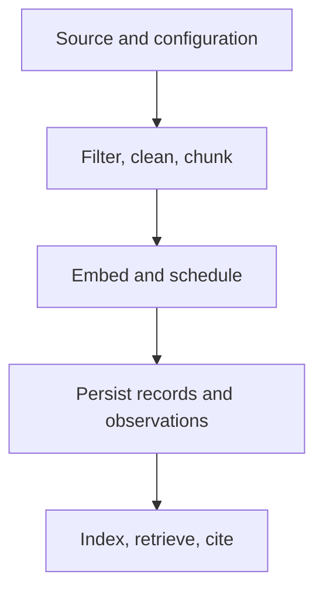

# Preparation Review

Review follows the data from source identity to downstream handoff. Begin at
the changed invariant, then inspect every serialization or execution boundary
the value crosses.

## Review one downstream record backward

Do not begin with aggregate counts. Choose one record that a consumer can
retrieve or cite and reconstruct its custody chain:

| Stop | Confirm | Refuse the review when |
| --- | --- | --- |
| candidate or citation | rank, score, index identity, chunk identity, and cited span | the result contains text but no stable prepared-material reference |
| chunk | exact text, start/end offsets, parent identity, geometry, and tail disposition | offsets cannot resolve against the retained normalized parent |
| normalized document | canonical fields, applied rules, safeguard outcome, and clean identity | normalization behavior depends on unrecorded defaults or locale |
| source record | source ID, adapter, original field mapping, and input digest | two distinguishable sources collapse into one identity |
| run configuration | normalized configuration and injected component identities | a mutable path or process environment is the only record of behavior |

Repeat the walk for a rejected source. Its path should end in a stable error
with stage, position, cause, and termination status—not in an absent output.

## Challenge the preparation boundary

Use adversarial cases that target the changed invariant rather than merely
adding more ordinary documents:

- two sources whose text normalizes identically but whose identities must stay
  distinct;
- text that lands exactly on and one unit beyond a chunk boundary;
- overlap equal to chunk size, negative geometry, and each tail policy;
- one failing record between successful records under fail-fast and
  error-collecting execution;
- interruption while a retry, breaker, cache write, or output write is active;
- persisted state produced by an older format or different normalized
  configuration; and
- a citation whose parent bytes change without its span changing.

The expected result may be a typed refusal. The review fails only when the
system accepts ambiguous state, loses custody, or reports a stronger outcome
than the retained evidence supports.

## Identity and transformation

- Is document identity derived before transformations that could erase source
  distinctions?
- Do normalization, chunk size, overlap, and tail policy participate in the
  retained configuration?
- Are spans interpreted against normalized text, and can every retained span
  be resolved?
- Does a change to identity or ordering include comparison against the prior
  behavior rather than only new happy-path fixtures?

## Execution and failure

- Does lazy execution preserve order, bounded buffering, termination, and
  backpressure?
- Are retries, breakers, caches, and resource lifetimes explicit at the point
  where they change behavior?
- Can partial failure be distinguished from an empty successful corpus?
- Do injected readers, cleaners, embedders, stores, and clocks have recorded
  identity when reproducibility depends on them?

## Public and persisted boundaries

- Do strict models reject unknown fields and incompatible vector dimensions?
- Do CLI and HTTP adapters preserve typed error meaning and nonzero failure
  status?
- Does persisted state reject incompatible formats and stale configuration?
- Are secrets, sensitive source text, and unbounded samples absent from logs
  and diagnostics?

## Retrieval interpretation

- Is the hash embedder described only as a deterministic baseline?
- Does a quality claim name its corpus, model profile, metrics, and threshold?
- Do citations retain chunk identity and resolvable span data?
- Is governed backend selection and replay left to `bijux-canon-index` rather
  than absorbed into ingest?

A review is complete when the evidence explains both accepted material and
rejected material. Route the result through [release acceptance](definition-of-done.md)
and check unresolved exposure in [known limitations](known-limitations.md).
