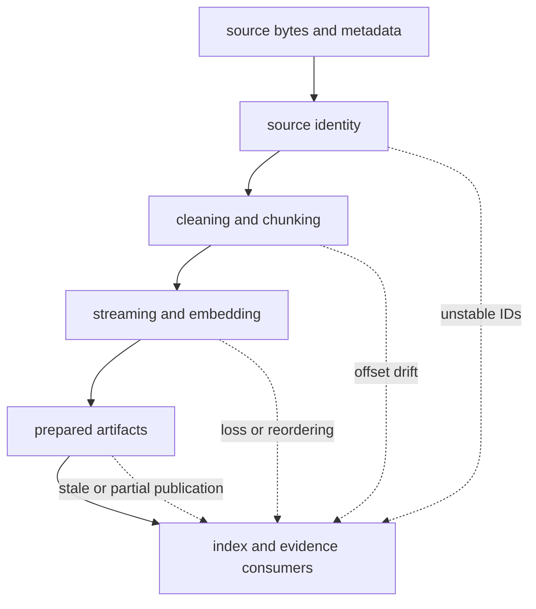
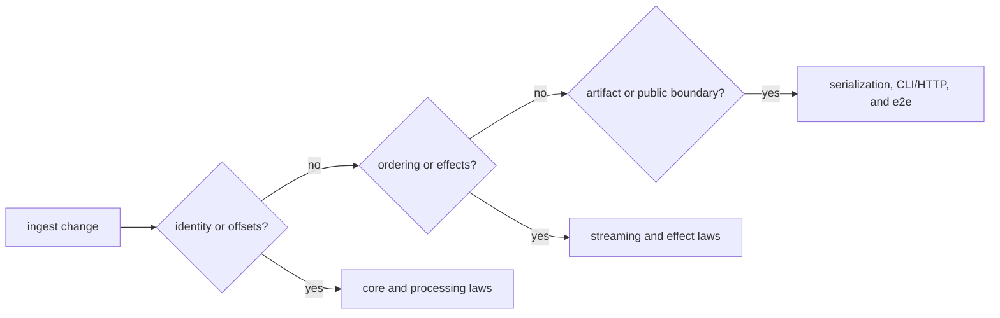

# Risk Register

Ingest establishes the identity and structure of material that every
downstream package treats as evidence. Its highest-impact failures often look
like successful processing: an index is populated, a query returns text, and
only later does a reviewer discover that offsets, normalization, or provenance
changed.

## Risk Topology

## Active Risks And Controls

| Risk | Consequence | Preventive control | Detection evidence | Residual exposure |
| --- | --- | --- | --- | --- |
| source identity changes across equivalent input | duplicates, broken joins, and irreproducible citations | derive stable identity before transformation and retain source metadata | core type round trips, document-input tests, repeated-run comparison | upstream metadata can still be unstable or incomplete |
| normalization changes content without a contract change | content keys, spans, and downstream rankings drift | explicit cleaning configuration and cache invalidation | cleaning configuration and processing-stage tests | Unicode libraries and caller preprocessing remain external inputs |
| chunk spans detach from normalized text | citations point to the wrong passage | validate boundaries, tail policy, and stable ordering | chunking, async chunking, and core round-trip tests | consumers can still discard offsets |
| streaming drops, duplicates, or reorders items | prepared corpora are incomplete while the run appears healthy | bounded fan-in/fan-out, contiguity checks, typed termination | streaming, scheduling, gather, and backpressure law tests | process termination can interrupt a multi-file run |
| partial failures are flattened into empty success | missing documents become invisible | retain `Result` values, counts, stage, position, and termination reason | result folds, result streams, reports, and pipeline observations | applications can ignore surfaced errors |
| embedder identity or numerics drift | dimensions or rankings change between runs | record adapter, model, version, dimension, and fingerprint | embedder factory tests plus offline evaluation | external model services may change behind a stable name |
| stale cache or index state is reused | outputs mix semantics from different configurations | version cache namespaces and validate serialization envelopes | memoization, index loading, codec, and end-to-end persistence tests | no transaction spans every run artifact |
| sensitive text escapes through logs or samples | source confidentiality is violated | bound observations and redact at interfaces | observability and report tests plus deployment review | package checks cannot determine corpus sensitivity |
| local retrieval grows into governed index policy | ownership and replay semantics split across packages | keep ingest retrieval a reference seam and move governed execution to index | dependency review and package-boundary checks | convenience APIs can encourage accidental expansion |

## Acceptance By Change Type

A change can require more than one path. An embedding-cache change, for
example, needs adapter identity tests, cache behavior tests, serialization
evidence, and an offline quality comparison if ranking claims change.

## Operational Interpretation

No table entry is “closed” merely because its current unit tests pass. These
are persistent hazards at package boundaries. A release narrows them through
specific controls and evidence; deployment owners still supply corpus access,
retention, model governance, storage durability, and recovery procedures.

Use [architecture risks](../architecture/architecture-risks.md) for failure
mechanisms, [test strategy](test-strategy.md) for executable evidence, and
[known limitations](known-limitations.md) for deliberately unsupported claims.
