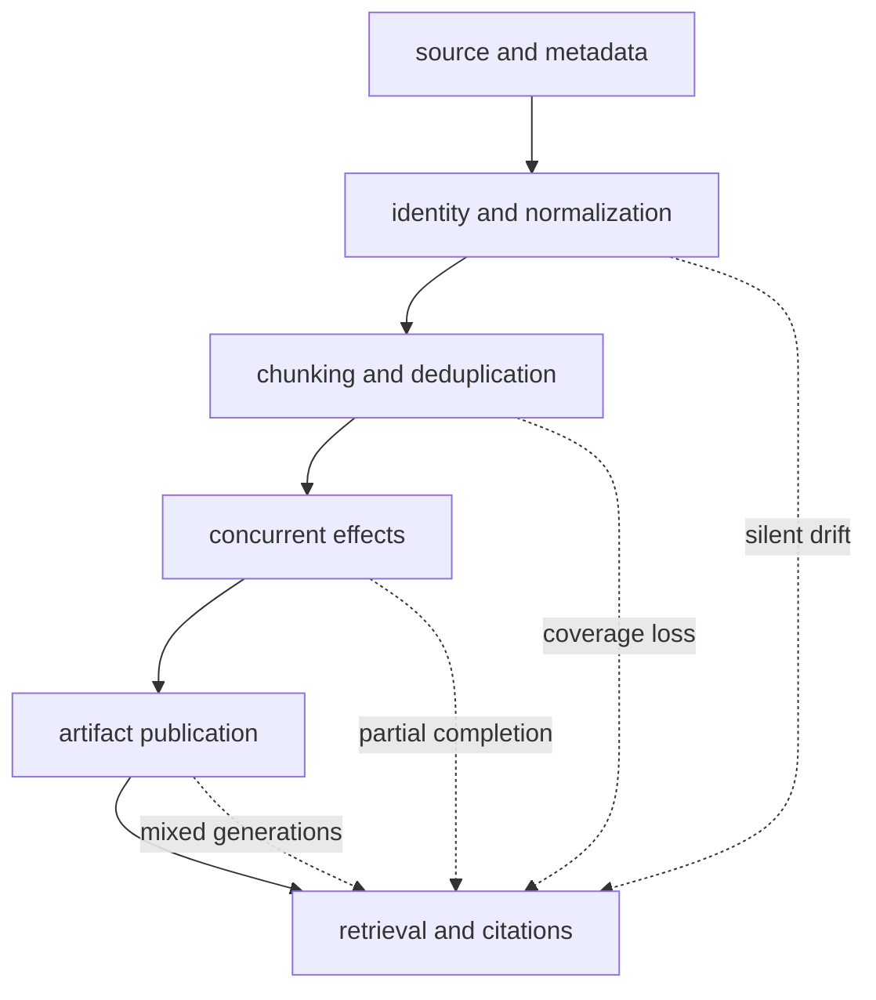
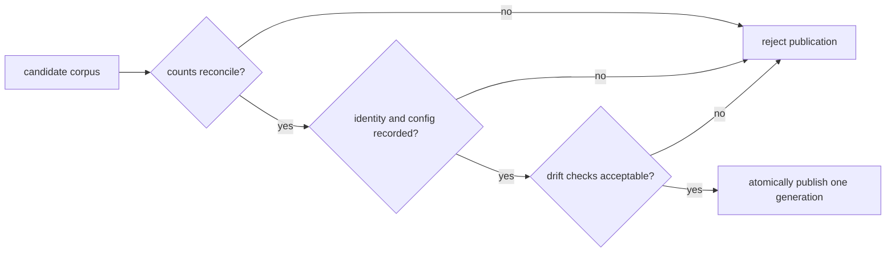

# Risk Register

Ingest failures are dangerous when they remain structurally valid. A corpus can
produce chunks, build an index, and answer queries while its identity, offsets,
or completeness have already drifted. This register treats a green API response
as execution evidence, not proof that the prepared corpus is fit for use.

## Failure Propagation

## Persistent Risks

Impact describes the worst credible effect at the package boundary. Detection
names the signal an operator can retain, not merely a test that maintainers run.

| Hazard | Impact | Observable signal | Control | Residual owner |
| --- | --- | --- | --- | --- |
| unstable source identity | high: duplicate content, broken joins, irreproducible citations | equivalent bytes produce different document IDs or one ID maps to different digests | derive identity before transformation; retain source digest and metadata | source adapter owner |
| normalization or chunk-policy drift | high: changed content keys, spans, and rankings | normalized digest, chunk count, boundary distribution, or tail count changes for the same fixture | version configuration; compare golden corpus manifests before publication | pipeline owner |
| offsets are interpreted as original bytes | high: citations select the wrong passage | `normalized_text[start:end]` matches while the original byte slice does not | label offset coordinate system; retain normalized text or its resolvable artifact | evidence consumer |
| structural deduplication is treated as semantic deduplication | medium: repeated claims distort retrieval | high near-duplicate rate remains after structural deduplication | run a separate, declared semantic-duplicate policy when required | corpus curator |
| ordered concurrency stalls behind a slow item | medium: latency and buffer pressure rise without progress | oldest pending position age and ordered-buffer occupancy increase | bound concurrency and timeouts; expose position and termination reason | deployment operator |
| unordered execution is mistaken for source order | high: downstream joins or deterministic snapshots drift | completion positions differ while item identities remain stable | select ordered policy or explicitly sort by stable identity before publication | pipeline integrator |
| expected errors are collapsed into empty success | high: corpus is incomplete without an alarm | input, success, error, and terminal counts do not reconcile | retain `Result` values and observations; reject unreconciled publication | application owner |
| retry repeats a non-idempotent external effect | high: duplicate writes or charges | attempts exceed one for the same idempotency key | retry only classified transient failures; make side effects idempotent | adapter owner |
| embedding identity or numerics drift | high: dimensions fail or rankings change | model revision, dimension, vector digest, or evaluation metrics differ | pin and record model inputs; gate publication on dimension and quality checks | model owner |
| stale cache crosses a semantic boundary | high: mixed cleaning, embedding, or schema semantics | cache namespace does not encode every meaning-bearing input | content-address and version cache keys; verify serialization envelope | cache owner |
| process-local HTTP index is treated as durable | high: indexes disappear on restart or diverge by worker | index ID is absent after restart or differs between workers | use explicit persistent storage or `bijux-canon-index` | service operator |
| sensitive text reaches observations | critical: confidentiality breach | raw text or metadata appears in logs, traces, samples, or cache entries | classify and redact before observation; bound sampling and retention | data controller |

## Publication Gate

Before publication, reconcile input, filtered, successful, failed, deduplicated,
and emitted counts. Then bind the corpus generation to source and normalized
digests, transform configuration, embedding identity, artifact schema, and index
fingerprint. Publish that generation atomically; do not assemble a live corpus
from independently current files.

## Change Evidence

Changes to identity, cleaning, chunking, or serialization require golden-corpus
comparison and round-trip evidence. Changes to scheduling, retry, timeout, or
breakers require ordering, cancellation, backpressure, and terminal-state
evidence. Changes to embeddings or retrieval require dimension checks,
fingerprint comparison, and an offline quality evaluation. HTTP or CLI boundary
changes additionally require schema or output snapshots.

Passing those checks narrows implementation risk; it does not transfer source
governance, model governance, privacy, durability, or disaster recovery into
the package. Those responsibilities remain with the residual owners above.

See [known limitations](known-limitations.md) for unsupported claims and
[architecture risks](../architecture/architecture-risks.md) for the underlying
failure mechanisms.
