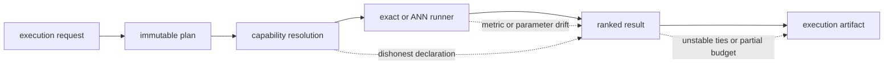

# Architecture Risks

Vector systems can return plausible neighbors while violating exactness,
identity, budget, or replay claims. Index therefore treats silent capability
drift as a larger architectural risk than an explicit refusal.

## Where A Plausible Result Can Diverge

The artifact must describe the path that executed, not merely the path the
request preferred. A typed refusal is safer than silently substituting a
runner whose capability changes the claim.

## Risk Register

| Risk | Misleading outcome | Control |
| --- | --- | --- |
| exactness overclaim | ANN output is labeled deterministic | validate contract against runner capability |
| backend or index drift | replay uses different code, parameters, or index state | fingerprint backend and artifact configuration |
| metric mismatch | scores appear valid but rank under different geometry | bind metric and normalization to the plan |
| identity loss | candidates cannot be traced to prepared material | preserve canonical vector and artifact IDs |
| partial finalization | ledger, run record, and native files disagree | fail on atomicity conflict and keep status incomplete/failed |
| plugin trust expansion | unreviewed code claims canonical capability | pin, review, and record plugin identity |
| service-state assumption | a Qdrant collection is missing, shared, or restored differently | govern service tenancy, backup, and collection identity |
| multi-tenant leakage | an artifact or run crosses tenant scope | validate tenant on every read, write, export, and replay |

## Approximation Without a Loss Contract

Target recall, candidate pool, witness sample, HNSW parameters, probe budget,
and exact-rescore posture change the meaning of an ANN result. Recording only
the final IDs makes the run observable but not reproducible. Non-deterministic
execution must declare and retain these inputs or be labeled non-replayable.

## Backend Names Can Conceal Different Semantics

“SQLite,” “HNSW,” or “FAISS” is not a sufficient execution identity. Library
version, index construction parameters, persistence path, vector
normalization, and fallback runner all matter. Capability discovery and the run
record must describe what actually executed, including reference fallbacks.

The experimental pgvector-named path is a specific example: its current
implementation delegates to SQLite and is excluded from v1. Presenting it as a
production PostgreSQL seam would convert source naming into a false capability
claim.

## Persistence Is Distributed Across Domains

An execution can touch ledger state, run JSON, SQLite, native index files, an
embedding cache, or an external collection. No single file proves that all
domains agree. Recovery and export must begin from artifact and execution
fingerprints, then verify every required persistence domain.

## Budget Failure Can Look Like Search Quality

A latency, memory, probe, distance, or vector limit may yield partial evidence.
Returning that subset as a normal top-`k` result hides resource exhaustion as a
ranking decision. Preserve the exhausted dimension, retry posture, and partial
classification in the failure.

## Root and Compatibility Surfaces Can Drift

The canonical root deliberately exports only version metadata, while the
module CLI and compatibility package expose broader surfaces. Adding convenient
root exports or assuming a nonexistent canonical console script can create a
contract that packaging does not support. Test installed-wheel behavior, not
only source-checkout imports.

## Provenance Can Become Larger Than the Result

Plans, witnesses, costs, backend metadata, vectors, and plugin diagnostics may
contain sensitive or high-volume data. Bound and classify provenance without
removing the identity needed to audit execution. Logging everything is neither
a replay design nor a safe retention policy.

See [security and safety](../operations/security-and-safety.md) and
[known limitations](../quality/known-limitations.md) for operational posture.
