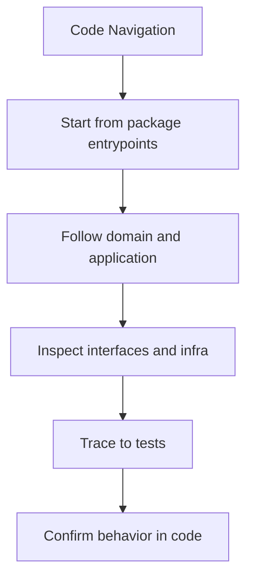

# Code Navigation

When you need to understand a change in `bijux-canon-index`, use this reading order:

This page is intentionally practical. Its purpose is to shorten the path from a
question in review to the files that actually explain the answer.

Treat the architecture pages for `bijux-canon-index` as a reviewer-facing map of structure and flow. They should shorten code reading, not try to replace it.

## Visual Summary

## Reading Order

- start at the relevant interface or API module
- move into the owning application or domain module
- finish in the tests that protect the behavior

## Concrete Anchors

- `src/bijux_canon_index/domain` for execution, provenance, and request semantics
- `src/bijux_canon_index/application` for workflow coordination
- `src/bijux_canon_index/infra` for backends, adapters, and runtime environment helpers
- `src/bijux_canon_index/interfaces` for CLI and operator-facing edges
- `src/bijux_canon_index/api` for HTTP application surfaces
- `src/bijux_canon_index/contracts` for stable contract definitions

## Test Anchors

- tests/unit for API, application, contracts, domain, infra, and tooling
- tests/e2e for CLI workflows, API smoke, determinism gates, and provenance gates
- tests/conformance and tests/compat_v01 for compatibility behavior
- tests/stress and tests/scenarios for operational pressure checks

## Concrete Anchors

- `src/bijux_canon_index/domain` for execution, provenance, and request semantics
- `src/bijux_canon_index/application` for workflow coordination
- `src/bijux_canon_index/infra` for backends, adapters, and runtime environment helpers

## Use This Page When

- you are tracing structure, execution flow, or dependency pressure
- you need to understand how modules fit before refactoring
- you are reviewing design drift rather than one isolated bug

## Decision Rule

Use `Code Navigation` to decide whether a structural change makes `bijux-canon-index` easier or harder to explain in terms of modules, dependency direction, and execution flow. If the change works only because the design becomes harder to read, the safer answer is redesign rather than acceptance.

## What This Page Answers

- how `bijux-canon-index` is organized internally in terms a reviewer can follow
- which modules carry the main execution and dependency story
- where structural drift would show up before it becomes expensive

## Reviewer Lens

- trace the described execution path through the named modules instead of trusting the diagram alone
- look for dependency direction or layering that now contradicts the documented seam
- verify that the structural risks named here still match the current code shape

## Honesty Boundary

This page describes the current structural model of `bijux-canon-index`, but it does not guarantee that every import path or runtime path still obeys that model. Readers should treat it as a map that must stay aligned with code and tests, not as an authority above them.

## Next Checks

- move to interfaces when the review reaches a public or operator-facing seam
- move to operations when the concern becomes repeatable runtime behavior
- move to quality when you need proof that the documented structure is still protected

## Purpose

This page shortens the path from an issue report to the relevant code.

## Stability

Keep it aligned with the real source tree and current test layout.
