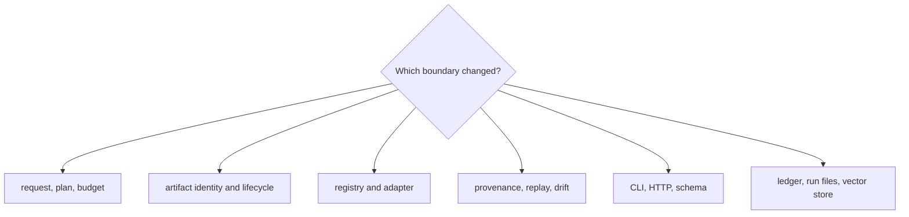

# Code Navigation

Navigate index by the governed execution lifecycle. Begin with the request or
artifact contract, follow orchestration into capability resolution and the
selected adapter, then end at provenance and run finalization.

```mermaid
flowchart TD
    question{"Which boundary changed?"}
    request["request, plan, budget"]
    artifact["artifact identity and lifecycle"]
    backend["registry and adapter"]
    evidence["provenance, replay, drift"]
    surface["CLI, HTTP, schema"]
    store["ledger, run files, vector store"]

    question --> request
    question --> artifact
    question --> backend
    question --> evidence
    question --> surface
    question --> store
```

## Navigate by concern

| Concern | Begin in | Continue in | Evidence family |
| --- | --- | --- | --- |
| intent, mode, contract, or budget | `domain/requests/` and `core/` execution types | interface request schemas | core and request-domain tests |
| plan identity or mutation refusal | `domain/requests/execution_plan.py` | application execution runtime | ABI, immutability, and determinism conformance |
| artifact construction or identity | `domain/artifact/` | materialization orchestration and migrations | lifecycle, portability, and golden replay tests |
| exact scoring or tie order | `domain/algorithms/` | exact adapter selected by the engine | scoring and cross-backend query conformance |
| ANN behavior | `domain/non_determinism/` | `infra/adapters/ann_*`, HNSW, or optional adapter | exact-versus-ANN diff, replay, and stress evidence |
| backend eligibility | vector-store/runner registries and plugin contracts | capabilities report and runtime bootstrap | capability, plugin, and dishonest-backend tests |
| explanation, lineage, or replay | `domain/provenance/` and `domain/drift/` | query introspection and replay orchestration | provenance and replay gates |
| execution ledger or run files | engine state and `infra/run_store.py` | storage adapter and migration code | transaction, corruption, isolation, and lifecycle tests |
| CLI behavior | `interfaces/cli/` | application orchestration and rendering | CLI snapshots, exits, and workflows |
| HTTP behavior | `api/v1/` and `interfaces/schemas/` | engine bootstrap and tracked schema | DTO, OpenAPI freeze, and API smoke tests |

Paths are relative to
`packages/bijux-canon-index/src/bijux_canon_index/` unless stated otherwise.

## Trace one execution

1. Load the boundary model in `interfaces/schemas/requests.py` or the owning
   domain request.
2. Follow normalization and dispatch in `application/orchestration/`.
3. Inspect artifact and plan invariants before looking at an adapter.
4. Follow registry resolution into the selected exact or ANN implementation.
5. Return through result records, provenance, execution tracking, and
   `infra/run_store.py`.
6. Confirm the focused unit and conformance tests; add golden replay evidence
   when serialized identity changes.

## Diagnose from the governed record

| Symptom | Inspect first | Follow into | Evidence that resolves ownership |
| --- | --- | --- | --- |
| request is unexpectedly refused | normalized request, contract, mode and budget | domain validation then interface translation | violated invariant and stable typed refusal |
| artifact fingerprint changed | source/vector/configuration identities and build plan | `domain/artifact/` then materialization/storage | field-level fingerprint diff and migration/refusal result |
| backend is not selected | capability request and exclusions | registry/plugin discovery and adapter capability report | eligible/ineligible decision per required capability |
| exact ranks or ties differ | metric inputs, normalization and stable ordering rule | `domain/algorithms/` then exact runner | cross-backend exact fixture with ordered IDs/scores |
| ANN quality or result varies | non-determinism profile, parameters, seed/sources and candidate path | `domain/non_determinism/` then ANN adapter | exact baseline, quality threshold, witness and replay diff |
| budget appears ignored | requested limit and observed cost record | execution plan, runner accounting and partial/refusal path | consumed dimensions and terminal disposition |
| explanation cannot join a result | result/artifact/backend/run identities | provenance construction and run finalization | complete query-to-vector-to-rank lineage |
| persisted run is incomplete or corrupt | run state and three-file identities | `infra/run_store.py`, atomic write and load validation | precise incomplete/corrupt refusal without authoritative load |
| replay passes changed state | original envelope and observed fingerprints | provenance replay and drift semantics | blocking semantic diff, verdict and reason |
| CLI and HTTP differ | shared application result and boundary DTOs | render/error mapping at each interface | equivalent request yields equivalent typed outcome |

Begin with the retained request, artifact, result or replay record. Adapter logs
are supporting evidence; they cannot replace the package-owned identity that
locates the first broken boundary.

## Place a change without leaking backend policy

| Desired change | Primary location | Evidence expansion |
| --- | --- | --- |
| stable execution primitive or ABI field | `core` | identity, serialization, compatibility and public DTO coverage |
| request, artifact, provenance, drift or ANN semantic | matching `domain/` area | unit laws plus cross-implementation conformance |
| complete materialize/execute/replay use case | `application/orchestration/` | domain evidence and interface path as applicable |
| backend, embedder, runner or store | `infra/` | capability declaration, conformance, failure injection and migrations |
| plugin entry point | `infra/plugins/` | discovery, duplicate/conflict, isolation and malformed implementation cases |
| command or HTTP operation | `interfaces/` or `api/v1/` | shared application behavior, schema, statuses and typed errors |

If a fix is duplicated in multiple adapters, identify the common invariant and
move it to the domain contract. If only one SDK needs translation, keep it in
that adapter and preserve the shared result/error shape.

## Compatibility landmarks

| Landmark | Why it matters |
| --- | --- |
| `core/contracts/` | execution ABI, determinism, ANN metadata, and performance contracts |
| `core/v1_exclusions.py` | features deliberately outside the frozen surface |
| `apis/bijux-canon-index/v1/schema.yaml` | versioned HTTP contract |
| `tests/compat_v01/` | public API, CLI, and golden replay compatibility |
| `tests/conformance/` | behavior shared across implementations |
| `tests/scenarios/` and `tests/misuse/` | drift, corruption, isolation, and invalid authority paths |

When a backend-specific failure exposes a common contract defect, place the
fix and its primary test at the domain or conformance boundary rather than
encoding policy in a single adapter.
