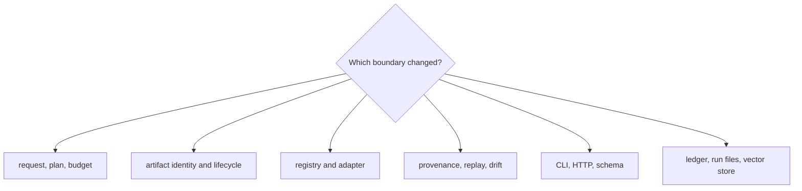

# Code Navigation

Navigate index by the governed execution lifecycle. Begin with the request or
artifact contract, follow orchestration into capability resolution and the
selected adapter, then end at provenance and run finalization.

```mermaid
flowchart TD
    question{"Which boundary changed?"}
    request["request, plan, budget"]
    artifact["artifact identity and lifecycle"]
    backend["registry and adapter"]
    evidence["provenance, replay, drift"]
    surface["CLI, HTTP, schema"]
    store["ledger, run files, vector store"]

    question --> request
    question --> artifact
    question --> backend
    question --> evidence
    question --> surface
    question --> store
```

## Navigate by concern

| Concern | Begin in | Continue in | Evidence family |
| --- | --- | --- | --- |
| intent, mode, contract, or budget | `domain/requests/` and `core/` execution types | interface request schemas | core and request-domain tests |
| plan identity or mutation refusal | `domain/requests/execution_plan.py` | application execution runtime | ABI, immutability, and determinism conformance |
| artifact construction or identity | `domain/artifact/` | materialization orchestration and migrations | lifecycle, portability, and golden replay tests |
| exact scoring or tie order | `domain/algorithms/` | exact adapter selected by the engine | scoring and cross-backend query conformance |
| ANN behavior | `domain/non_determinism/` | `infra/adapters/ann_*`, HNSW, or optional adapter | exact-versus-ANN diff, replay, and stress evidence |
| backend eligibility | vector-store/runner registries and plugin contracts | capabilities report and runtime bootstrap | capability, plugin, and dishonest-backend tests |
| explanation, lineage, or replay | `domain/provenance/` and `domain/drift/` | query introspection and replay orchestration | provenance and replay gates |
| execution ledger or run files | engine state and `infra/run_store.py` | storage adapter and migration code | transaction, corruption, isolation, and lifecycle tests |
| CLI behavior | `interfaces/cli/` | application orchestration and rendering | CLI snapshots, exits, and workflows |
| HTTP behavior | `api/v1/` and `interfaces/schemas/` | engine bootstrap and tracked schema | DTO, OpenAPI freeze, and API smoke tests |

Paths are relative to
`packages/bijux-canon-index/src/bijux_canon_index/` unless stated otherwise.

## Trace one execution

1. Load the boundary model in `interfaces/schemas/requests.py` or the owning
   domain request.
2. Follow normalization and dispatch in `application/orchestration/`.
3. Inspect artifact and plan invariants before looking at an adapter.
4. Follow registry resolution into the selected exact or ANN implementation.
5. Return through result records, provenance, execution tracking, and
   `infra/run_store.py`.
6. Confirm the focused unit and conformance tests; add golden replay evidence
   when serialized identity changes.

## Compatibility landmarks

| Landmark | Why it matters |
| --- | --- |
| `core/contracts/` | execution ABI, determinism, ANN metadata, and performance contracts |
| `core/v1_exclusions.py` | features deliberately outside the frozen surface |
| `apis/bijux-canon-index/v1/schema.yaml` | versioned HTTP contract |
| `tests/compat_v01/` | public API, CLI, and golden replay compatibility |
| `tests/conformance/` | behavior shared across implementations |
| `tests/scenarios/` and `tests/misuse/` | drift, corruption, isolation, and invalid authority paths |

When a backend-specific failure exposes a common contract defect, place the
fix and its primary test at the domain or conformance boundary rather than
encoding policy in a single adapter.
