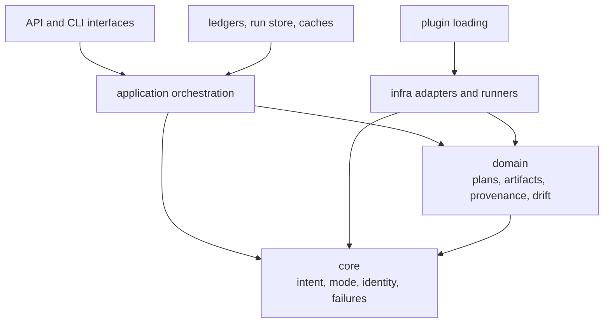

# Dependency Direction

Index separates retrieval meaning from backend mechanics. Execution contracts,
plans, artifacts, provenance, and non-determinism policy remain valid concepts
without SQLite, HNSW, FAISS, Qdrant, a CLI, or an HTTP server.

The domain defines what execution means. Infrastructure demonstrates that a
concrete backend can satisfy that meaning.

## Stable Inner Layers

`core` owns execution intent and mode, identity, deterministic posture,
configuration primitives, typed failures, and the frozen v1 exclusions.
`domain` owns algorithms, requests, artifacts, provenance, drift, and
non-determinism semantics.

Neither layer should import a CLI renderer, FastAPI model, environment reader,
or backend client. A domain plan may require a capability, but it must not
construct the adapter that provides it.

## Application Authority

`application` normalizes requests, resolves artifacts, checks capabilities,
constructs plans, dispatches execution, and finalizes ledger and run evidence.
It coordinates concrete capabilities through contracts; it does not erase
backend identity or translate refusal into an empty result.

The application layer is also where transaction boundaries become explicit.
If ledger state and run-store state cannot be finalized consistently, the
operation fails rather than allowing one record to impersonate a completed
execution.

## Infrastructure Direction

`infra.adapters` implements memory, SQLite, HNSW, FAISS, Qdrant, and excluded
experimental paths. `infra.runners` implements exact and ANN execution.
Embedding caches, migrations, plugins, runtime paths, and run records also live
at this edge.

Adapters depend on domain contracts and translate backend data into canonical
results. Canonical types must not acquire backend-specific fields merely
because one engine exposes them. Backend metadata belongs in capability,
artifact, cost, or provenance records.

## Interface Direction

The module CLI and v1 HTTP API translate boundary payloads into application
requests. They own parsing, rendering, response codes, and refusal envelopes.
They may not bypass planning to call a vector client directly.

The package root exports version metadata only. That narrow root prevents a
large adapter graph from becoming an implicit stable API. Import execution
types and engines from the modules that own them.

## Forbidden Reversals

Architecture is drifting when:

- domain code checks `BIJUX_CANON_INDEX_*` environment variables;
- a request type imports FAISS or Qdrant classes;
- an adapter decides whether approximation is acceptable;
- CLI defaults change the meaning of a stored plan without recording it;
- replay comparison reaches into a live backend instead of using declared
  artifact and execution identities.

Use the [module map](module-map.md) for owned surfaces and
[integration seams](integration-seams.md) for concrete boundary choices.
