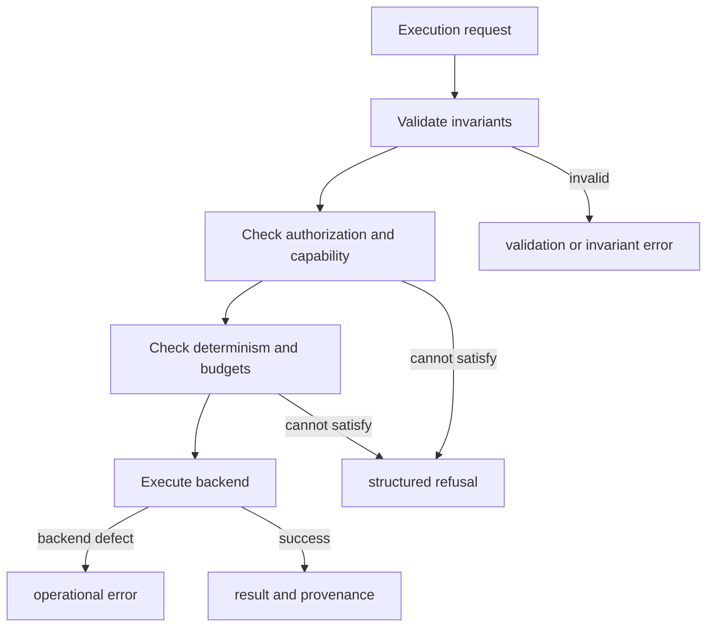

# Error Model

Index treats refusal as a first-class outcome. A request can be well formed and
still be refused because its determinism, capability, authorization, or budget
contract cannot be satisfied. That is different from no matching vectors and
different again from a corrupt artifact or backend defect.

## Taxonomy

| Error | Meaning | Retry posture |
| --- | --- | --- |
| `ValidationError` | Input shape or value is invalid | Repair the request |
| `InvariantError` | A domain rule such as vector dimension or execution-mode compatibility was broken | Repair construction or implementation |
| `ConfigurationError` | Backend, embedding, cache, or resource configuration is incomplete or invalid | Repair configuration |
| `DeterminismViolationError` | The requested replay or determinism claim cannot be honored | Change inputs or explicitly choose bounded non-determinism |
| `BackendCapabilityError` | The selected backend lacks a required operation | Select a capable backend or change the request |
| `BackendUnavailableError` | A configured backend cannot be reached or opened | Retry only after checking connectivity and credentials |
| `BudgetExceededError` | Latency, memory, error, vector, distance, probe, or request limit was exceeded | Reduce work or explicitly revise the budget |
| `AuthzDeniedError` | Authorization policy rejected the operation | Do not retry without new authority |
| `CorruptArtifactError` | Stored data failed integrity or compatibility checks | Quarantine and rebuild from trusted inputs |
| `ConflictError` or `AtomicityViolationError` | State versioning or transaction guarantees failed | Resolve state ownership before retrying |
| `BackendDivergenceError` | Backend behavior violated the recorded execution contract | Preserve evidence and investigate backend identity |
| `ReplayNotSupportedError` | Replay was requested for an execution that did not establish replayability | Treat as non-replayable; do not synthesize parity |
| ANN and plugin errors | Approximate-index build/query or plugin load/call failed | Follow the recorded capability and retry hint |

All package errors carry a message, invariant identifier, and retryability
flag. Budget errors additionally retain the exhausted dimension and any
explicit partial results. Partial results are evidence of interrupted work,
not a successful top-`k` response.

## Refusal path

The interface refusal envelope names a reason, message, and remediation for
configuration, determinism, backend capability, backend availability, and
budget failures. Preserve that envelope across HTTP or CLI boundaries. Mapping
it to an empty candidate list makes a contract failure indistinguishable from
a valid search with no matches.

## Exact and approximate failures

Deterministic requests require strict mode and reject ANN settings.
Non-deterministic requests require bounded or exploratory mode, an execution
budget, and declared randomness. ANN settings validate recall, candidate pool,
diversity, witness, latency, index-memory, and search parameters before work
begins.

An approximate low-signal refusal is not backend unavailability. A witness
quality failure is not exact-result corruption. Keep the declared loss posture,
ANN parameters, witness evidence, and failure reason together.

## Replay failures

Replay can fail because the original run was non-replayable, an artifact is
missing or corrupt, index or parameter identity changed, the backend diverged,
or the comparison exceeded policy. Each cause changes the conclusion. Never
report “replay mismatch” without the identity and contract dimension that
differed.
