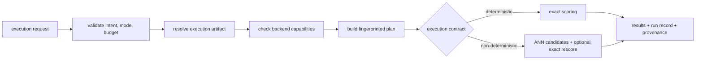
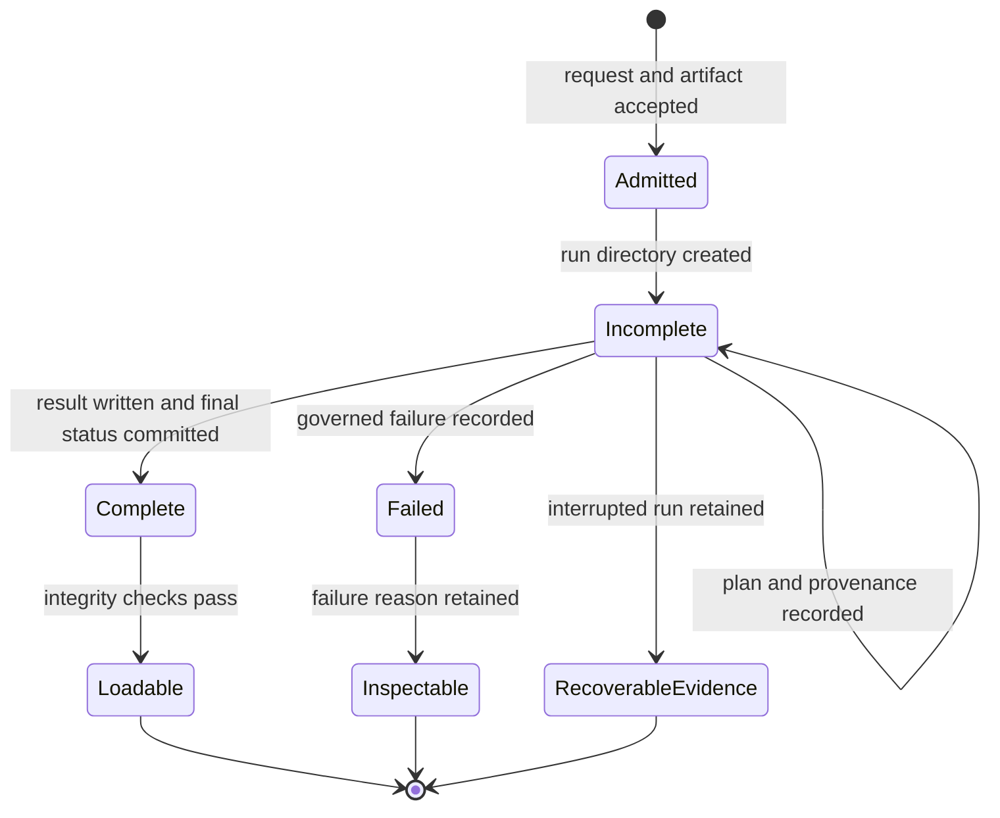

# Execution Model

`bijux-canon-index` treats retrieval as governed execution. A query is not sent
straight to a vector store: the package first resolves an immutable artifact,
checks the requested contract against backend capabilities, constructs a
fingerprinted plan, and records enough provenance to explain or replay the run.

## Request Normalization

The boundary payload names why and how retrieval may execute:

- `execution_intent` records why exactness or approximation is acceptable;
- `execution_mode` selects strict, bounded, or exploratory behavior;
- `execution_contract` chooses deterministic or non-deterministic semantics;
- `execution_budget` constrains latency, memory, or accepted error; and
- the randomness profile declares seeds, sources, bounds, or intentional
  non-replayability.

Resource limits reject oversized queries and `top_k` values before execution.
An artifact must be selected explicitly unless the active ledger contains
exactly one. The request and artifact contracts must match.

## Admission Contract

Admission answers whether the requested result can be defended before backend
work begins. It combines request intent, artifact identity, backend capability,
and budget rather than treating each as an unrelated option.

| Requested property | Required evidence before execution | Refusal condition |
| --- | --- | --- |
| deterministic result | strict mode, exact path, compatible metric and dimension | ANN requested, incompatible mode, or replay guarantee unavailable |
| bounded approximation | non-deterministic contract, explicit randomness, budget, ANN capability | undeclared randomness, absent limits, or unsupported backend |
| replayable run | stable artifact, plan fingerprint, backend identity, replayable randomness | original run or selected backend cannot establish replayability |
| authorized mutation | matching artifact state and caller authority | stale version, ownership conflict, or authorization denial |

Admission success is not a promise that execution will complete. It establishes
that the selected path can satisfy the declared contract if its backend and
budgets hold. Later failures retain that admitted contract in the run record.

## Planning and Capability Checks

The planner validates backend support for the execution contract, metric,
vector dimension, ANN use, and deterministic replay. The plan fingerprint covers
the algorithm, contract, result count, scoring function, randomness sources,
reproducibility bounds, and ordered plan actions. It is recomputed before use;
a mutated or reconstructed plan is rejected.

Deterministic execution uses exact scoring and declares bit-identical
reproducibility. Non-deterministic execution requires ANN support and a declared
randomness profile. Its reproducibility bounds include the backend, index
configuration fingerprint, seed, replayability declaration, and optional ANN
profile and budgets.

## Exact and Approximate Paths

The exact path scores the artifact's vector set and applies an optional
pre-execution vector-count budget. The approximate path uses the resolved ANN
adapter. By default it follows candidate retrieval with exact rescoring;
`nd_two_stage` can disable that second action when the caller explicitly accepts
the corresponding semantics.

Approximate execution can also carry:

- target recall and latency bounds;
- witness sampling against exact search;
- candidate and probe caps;
- HNSW construction and search parameters;
- vector and query normalization policy;
- low-signal refusal thresholds; and
- strict replay checks for index and backend drift.

These settings belong in the run record because changing them changes the
meaning of the result even if the query vector is identical.

## Finalization

Successful execution writes the execution result and updated artifact in one
ledger transaction, then finalizes the file-backed run record. The returned
payload includes ordered result IDs, correlation ID, execution contract,
stability marker, replayability, and execution ID. Approximate runs also retain
their decision trace when one is available.

A run begins as `incomplete`, becomes `complete` only after `result.json` is
written, and becomes `failed` with a reason when governed error handling records
the failure. Incomplete and failed runs are not loadable as successful evidence.

The result file precedes the `complete` marker. Readers use the marker as the
publication boundary and do not infer success from the presence of a plan,
provenance file, or partial backend output. Failure recording preserves an
inspectable terminal state; it does not promote partial results into a valid
retrieval response.

## Result Semantics

An empty ordered result set is a successful retrieval outcome when execution
completed under the admitted contract. A refusal has no result set. A budget
failure may carry partial candidates as diagnostic evidence, but those
candidates have not satisfied the requested top-`k` contract. Consumers must
branch on run status and contract fields before reading result IDs.

## Ownership Map

- `application/orchestration/` normalizes requests, dispatches execution, and
  finalizes records.
- `domain/requests/execution_plan.py` owns plan construction and invariants.
- `domain/non_determinism/` owns ANN policy and approximation evidence.
- `domain/provenance/` owns lineage, comparison, and replay semantics.
- `infra/adapters/` resolves storage and vector backends by capability.
- `infra/run_store.py` owns the atomic run-record lifecycle.

See [Artifact Contracts](../interfaces/artifact-contracts.md) for retained
evidence and [Observability and Diagnostics](../operations/observability-and-diagnostics.md)
for inspection paths.
