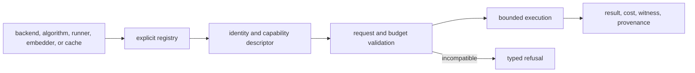

# Extensibility Model

Index extensions add a capability without weakening execution intent,
budgets, refusal, provenance, or replay. Registries select implementations;
canonical requests and artifacts continue to define their meaning.

## Extension path

A registered implementation is eligible for selection, not automatically
compatible with a request. Planning must refuse capabilities it cannot prove.

## Supported extension points

| Seam | Extension purpose | Required obligations |
| --- | --- | --- |
| Vector-store adapter | Add local, native, or remote vector persistence and search | Canonical IDs, dimension and metric checks, ordering, mutation semantics, isolation, lineage, and explicit capability reporting |
| Execution algorithm | Add exact or approximate search behavior | Declared contract support, deterministic tie handling, bounded cost, stable parameters, and typed result evidence |
| ANN adapter | Add an approximate index implementation | Build identity, seed/randomness posture, algorithm/version/parameters, memory and probe limits, witness support, and quality refusal |
| Embedding provider and cache | Transform text requests or reuse vectors | Model/provider identity, dimension, normalization, cache-key contract, versioning, and secret-safe provenance |
| Runner | Add an execution environment behind the runner registry | Stable descriptor, bounded lifecycle, normalized failures, and complete observed-cost reporting |
| Metrics sink | Export operational measurements | No authority over execution results; failures must not rewrite scientific evidence |
| Plugin entry point | Package reviewed registrations | Pinned code identity, controlled discovery, registration timeout, and the same capability checks as built-ins |

## Backend conformance

A backend extension must demonstrate:

1. exact and approximate claims separately, including unsupported operations;
2. metric and dimension behavior at ingest and query boundaries;
3. deterministic ordering and tie policy where deterministic execution is
   claimed;
4. transaction, consistency, deletion, and concurrent-writer semantics;
5. snapshot, export, restore, and replay requirements for backend-native state;
6. credential redaction and tenant isolation expectations;
7. stable mapping from backend errors to unavailable, capability, budget,
   divergence, and integrity failures.

An optional dependency importing successfully proves only importability.
Operational readiness requires an available resource and a capability report
that satisfies the request.

## Compatibility boundaries

Extensions may not redefine canonical request fields, artifact fingerprints,
result ordering, error taxonomy, or replay verdicts. New fingerprint inputs,
schema fields, modes, intent semantics, or replay comparisons are public
compatibility changes and require versioned contracts and migration behavior.

Approximate implementations cannot report deterministic equivalence merely
because a seed was supplied. They must also bind the index build, algorithm,
library version, parameters, candidate path, and randomness sources to the run.

## Trust model

Plugins and adapters execute with the process's filesystem, network, and
credential authority. Registry timeouts are not sandboxes. Untrusted or
tenant-supplied extensions belong in a separately isolated service with a
validated artifact boundary.

Use the [configuration surface](../interfaces/configuration-surface.md) to
declare resource and execution choices. The [security guide](../operations/security-and-safety.md)
defines the controls around plugins, credentials, and backend state.
