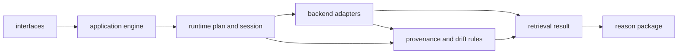

# Architecture

Open this section when the question is structural: where retrieval behavior lives, how search flow is organized, and which modules make replay and provenance credible instead of accidental.

## Structural Shape

Index architecture is built around executable retrieval contracts. Application
orchestration prepares the run, core runtime objects define the execution
shape, infrastructure adapters talk to vector backends, and domain provenance
modules keep replay and lineage reviewable after results leave the package.

This architecture only works if retrieval stays explainable at the moment it
happens. Application and runtime layers decide how a search is run, backend
adapters execute it, and domain provenance logic records enough context for a
later reviewer to understand why the result exists at all.

## Read These First

- open [Module Map](https://bijux.io/bijux-canon/03-bijux-canon-index/architecture/module-map/) first when you need the owning code area for a retrieval concern
- open [Execution Model](https://bijux.io/bijux-canon/03-bijux-canon-index/architecture/execution-model/) when you need the real path from prepared input to retrieval output
- open [Integration Seams](https://bijux.io/bijux-canon/03-bijux-canon-index/architecture/integration-seams/) when a change could blur the line between indexing, reasoning, or runtime

## Structural Risk

The main architectural risk here is letting retrieval semantics disappear inside adapters, plugins, or downstream expectations until the package cannot explain how search actually works.

## First Proof Check

- `packages/bijux-canon-index/src/bijux_canon_index/core/runtime` for retrieval execution plans and sessions
- `packages/bijux-canon-index/src/bijux_canon_index/infra/adapters` for vector backend boundaries
- `packages/bijux-canon-index/src/bijux_canon_index/domain/provenance` for audit, replay, and lineage logic
- `packages/bijux-canon-index/tests` for replay and provenance evidence at the package seam

## Pages In This Section

- [Module Map](https://bijux.io/bijux-canon/03-bijux-canon-index/architecture/module-map/)
- [Dependency Direction](https://bijux.io/bijux-canon/03-bijux-canon-index/architecture/dependency-direction/)
- [Execution Model](https://bijux.io/bijux-canon/03-bijux-canon-index/architecture/execution-model/)
- [State and Persistence](https://bijux.io/bijux-canon/03-bijux-canon-index/architecture/state-and-persistence/)
- [Integration Seams](https://bijux.io/bijux-canon/03-bijux-canon-index/architecture/integration-seams/)
- [Error Model](https://bijux.io/bijux-canon/03-bijux-canon-index/architecture/error-model/)
- [Extensibility Model](https://bijux.io/bijux-canon/03-bijux-canon-index/architecture/extensibility-model/)
- [Code Navigation](https://bijux.io/bijux-canon/03-bijux-canon-index/architecture/code-navigation/)
- [Architecture Risks](https://bijux.io/bijux-canon/03-bijux-canon-index/architecture/architecture-risks/)

## Leave This Section When

- leave for [Interfaces](https://bijux.io/bijux-canon/03-bijux-canon-index/interfaces/) when the structural question is already a public contract question
- leave for [Operations](https://bijux.io/bijux-canon/03-bijux-canon-index/operations/) when the issue is running, diagnosing, or releasing the package rather than explaining its shape
- leave for [Quality](https://bijux.io/bijux-canon/03-bijux-canon-index/quality/) when the structure is clear and the real question is whether the package has proved it strongly enough

## Design Pressure

If retrieval behavior disappears into adapters or backend terminology, the
package stops being auditable from its own structure. The architecture page
has to keep search intent, execution, and provenance visibly connected.
