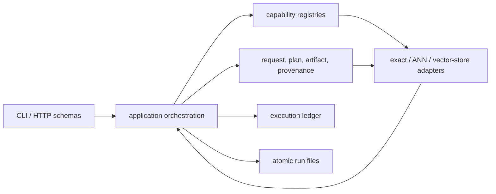
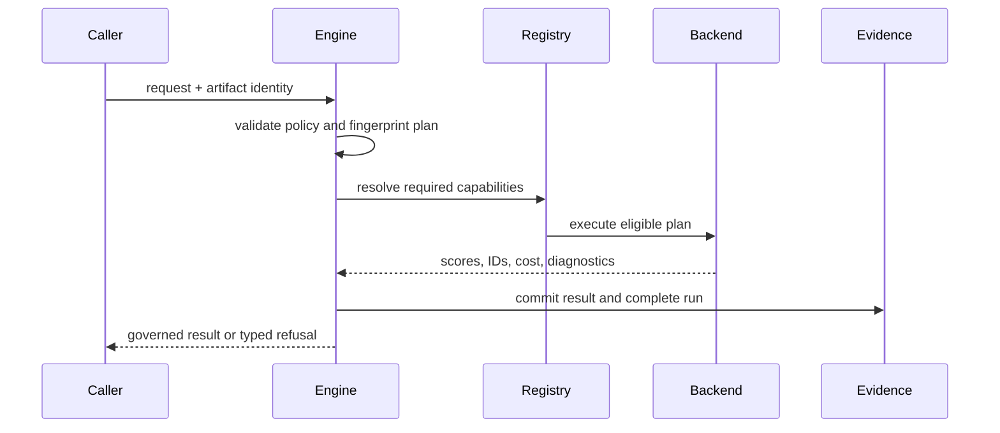
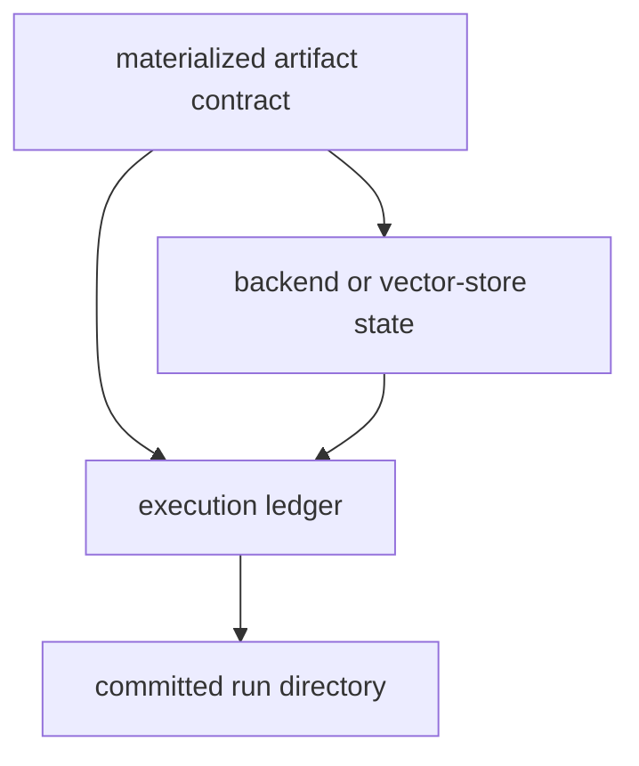

# Architecture

The index architecture makes retrieval policy explicit before backend work
begins. Interface models validate caller input, orchestration resolves state
and capabilities, domain plans encode invariants, adapters execute vector work,
and provenance records preserve the decision.

## Execution dependency graph

```mermaid
flowchart LR
    edge["CLI / HTTP schemas"]
    orchestration["application orchestration"]
    domain["request, plan, artifact, provenance"]
    registry["capability registries"]
    backend["exact / ANN / vector-store adapters"]
    ledger["execution ledger"]
    runs["atomic run files"]

    edge --> orchestration --> domain
    orchestration --> registry --> backend
    domain --> backend
    backend --> orchestration
    orchestration --> ledger
    orchestration --> runs
```

## Governed execution

```mermaid
sequenceDiagram
    participant Caller
    participant Engine
    participant Registry
    participant Backend
    participant Evidence
    Caller->>Engine: request + artifact identity
    Engine->>Engine: validate policy and fingerprint plan
    Engine->>Registry: resolve required capabilities
    Registry->>Backend: execute eligible plan
    Backend-->>Engine: scores, IDs, cost, diagnostics
    Engine->>Evidence: commit result and complete run
    Engine-->>Caller: governed result or typed refusal
```

Deterministic requests take the exact path. Non-deterministic requests require
ANN support and an explicit randomness profile; they can retrieve candidates
and apply exact rescoring when that action is part of the plan. Plan and
artifact fingerprints prevent a reconstructed or mutated execution from being
presented as the original.

## Ownership map

| Area | Authority |
| --- | --- |
| `interfaces` and `api/v1` | CLI, HTTP, strict schemas, rendering, and error translation |
| `application/orchestration` | bootstrap, ingest, materialization, dispatch, idempotency, and finalization |
| `domain/requests` | budgets, plan construction, scoring, validation, and result collection |
| `domain/artifact` | immutable executable corpus state and lifecycle |
| `domain/non_determinism` | ANN policy, randomness, witnesses, and approximation evidence |
| `domain/provenance` and `domain/drift` | lineage, audit, replay, comparison, and backend drift |
| `infra/adapters` | memory, SQLite, ANN, and optional vector-store implementations |
| `infra/run_store.py` | incomplete, complete, and failed run-file protocol |

## State model

The execution ledger and the run directory serve different purposes. The
ledger owns active documents, vectors, artifacts, transactions, and execution
records. A complete run directory retains metadata, result data, and a status
commit marker for later inspection. Vector-store persistence is another
boundary and does not replace either record.

## Four records, one execution

A reviewable retrieval result is assembled from records with different owners
and lifetimes. Treating any one of them as the whole execution loses evidence:

```mermaid
flowchart TD
    artifact["materialized artifact contract"]
    ledger["execution ledger"]
    backend["backend or vector-store state"]
    run["committed run directory"]
    artifact --> ledger
    artifact --> backend
    backend --> ledger
    ledger --> run
```

| Record | Establishes | Does not establish |
| --- | --- | --- |
| materialized artifact | eligible corpus identity, vectors, metric and frozen contract | that a backend executed it or that a run completed |
| execution ledger | active documents, transactions, execution and provenance state | portable completion evidence by itself |
| backend or vector-store state | implementation-specific index and retrieval capability | artifact identity, policy admission or run finalization |
| committed run directory | metadata, result and terminal status for inspection | availability of every external backend state or source payload |

Recovery must reconcile all records named by the original request. A readable
backend cannot replace a missing artifact contract, and a `result.json` without
the matching metadata and committed status remains an interrupted publication,
not execution evidence. Replay starts by validating these identities before it
interprets rank or score differences.

## Structural invariants

- An artifact contract cannot be silently rebound after materialization.
- A backend cannot execute a contract it did not declare as a capability.
- Deterministic execution requires strict mode; approximation remains visible
  in bounded or exploratory policy.
- A run becomes evidence only after its result is written and status becomes
  `complete`.
- Replay compares recorded identities and fingerprints before interpreting
  differences in rank or score.

## Navigate the design

| Need | Guide |
| --- | --- |
| Locate the owning module | [Module map](module-map.md) and [Code navigation](code-navigation.md) |
| Follow exact and approximate execution | [Execution model](execution-model.md) |
| Understand permitted dependency direction | [Dependency direction](dependency-direction.md) |
| Distinguish ledger, run, and vector-store state | [State and persistence](state-and-persistence.md) |
| Add an adapter or plugin | [Integration seams](integration-seams.md) and [Extensibility model](extensibility-model.md) |
| Trace refusal and failure | [Error model](error-model.md) |
| Review known structural hazards | [Architecture risks](architecture-risks.md) |
