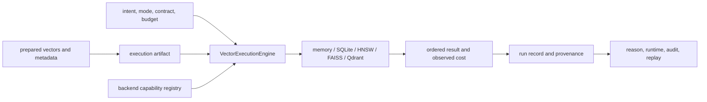

# Integration Seams

Index integrates through explicit execution requests, artifact identity,
capability reports, and provenance. A backend is never “just connected”: its
metric, dimension, exactness, persistence, replay, and failure behavior become
part of the execution contract.

## Seam Map

## Prepared-Data Seam

Ingest or application code supplies vectors, identifiers, metadata, metric,
and dimension. Index materializes those values into an artifact with a content
and configuration fingerprint. The handoff must preserve source or chunk
identity; an anonymous vector cannot later support evidence provenance.

Index does not clean source text or choose chunk boundaries. If a retrieval
problem is caused by those transformations, repair ingest and build a new
artifact rather than compensating in ranking code.

## Execution Seam

`ExecutionRequest` declares why and how work may run: intent, deterministic or
non-deterministic contract, strict/bounded/exploratory mode, `top_k`, budgets,
and randomness posture. The application engine validates this request against
artifact and backend capabilities before execution.

This seam is the preferred Python integration. Passing a raw backend client
around the application bypasses refusal, cost, provenance, and replay behavior.

## Backend Seam

The vector-store registry reports availability and constructs adapters. Memory
and SQLite provide local behavior; HNSW and FAISS add native index state;
Qdrant connects to service-owned collections. Optional dependencies make a
backend importable, not operationally ready.

Every adapter must preserve canonical IDs, ordering, metric semantics,
dimension validation, and explicit capability refusal. Approximate adapters
must also expose index parameters, seed/replay conditions, and witness evidence
required by the request.

The pgvector-named adapter is currently excluded from the frozen v1 surface and
delegates to SQLite-backed resources. It is not a PostgreSQL deployment seam.

## Plugin Seam

Plugins can add backend behavior through registration, but they execute Python
inside the index process. Registration does not grant trust. Operators must pin
and review plugin code, record its identity and version, and reject capability
claims that cannot be verified.

Plugins may implement a capability; they may not redefine canonical request,
artifact, error, or replay contracts.

## Persistence Seam

The application ledger stores artifact and execution state. The file-backed
run store records `metadata.json`, `result.json`, and `status.json` beneath the
configured run root. A run becomes loadable evidence only after status changes
to `complete`.

Native index files, external service collections, ledger records, and run JSON
are separate persistence domains. Export or replay tooling must bind their
identities; copying a completed run directory alone does not copy its backend
state.

## Interface Seams

- The canonical CLI is the module application
  `python -m bijux_canon_index.interfaces.cli.app`; the wheel currently has no
  `bijux-canon-index` console script.
- The v1 HTTP API exposes capability discovery, artifact operations, execution,
  explanation, and replay through checked schemas.
- The `bijux-vex` compatibility package preserves the legacy command and import
  surface while delegating to canonical behavior.

See [configuration](../interfaces/configuration-surface.md) and
[artifact contracts](../interfaces/artifact-contracts.md) before binding a
production backend.
