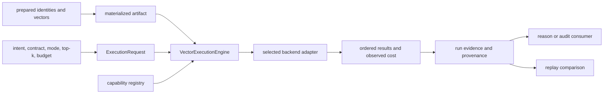
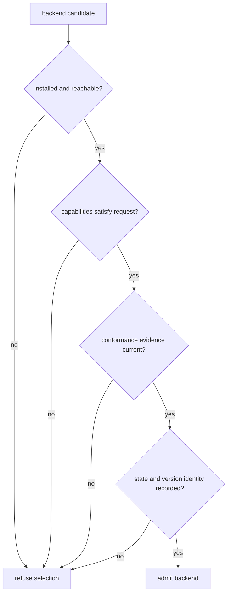

# Integration Seams

Index turns prepared vectors and declared intent into an execution claim. A
backend connection alone is not an integration: dimension, metric, exactness,
capabilities, budgets, persistence identity, failure behavior, and replay
posture must all cross the seam.

## Execution Handoff

The artifact says what can be searched. The request says what is allowed. The
capability decision says which backend may execute it. The result and record
say what actually happened. None can substitute for another.

## Seam Contracts

| Seam | Required input | Produced evidence | Refusal boundary |
| --- | --- | --- | --- |
| prepared data | stable record IDs, vectors, dimension, metric, metadata, corpus identity | content/configuration fingerprint and materialized artifact | anonymous vectors, dimension conflict, invalid geometry |
| execution request | intent, execution contract, mode, `top_k`, budget, randomness posture | immutable normalized plan and request identity | unsupported combination or missing bounded-execution fields |
| capability registry | available adapter factories and honest reports | selected backend identity and capability decision | unavailable, incompatible, or dishonest backend |
| backend adapter | validated artifact and plan | ordered candidates, scores, cost, approximation report | transaction, query, budget, drift, or capability failure |
| persistence | run and backend identities | lifecycle record, result, native-state references | incomplete generation or unresolved backend state |
| downstream | complete execution result and provenance | no hidden dependency on backend client | partial/refused status, missing corpus identity, missing replay fields |

## Prepared Data Is Not Anonymous Geometry

Ingest or application code owns cleaning and chunking. Index receives the
resulting identifiers, metadata, vectors, metric, and dimension. If preparation
changes, build a new artifact. Ranking code must not compensate invisibly for
changed chunk meaning or mislabeled embeddings.

The artifact fingerprint binds content and build configuration. Preserve source
or chunk identity with every vector so a neighbor can become addressable
evidence rather than an unexplained row number.

## Backend Admission

Memory and SQLite provide local execution. HNSW and FAISS add native state.
Qdrant adds service-owned state. Optional installation proves only that code
can import; service readiness, native compatibility, and durability require
separate evidence.

The pgvector-named adapter is excluded from the stable contract and delegates
to SQLite-backed resources. It is not a PostgreSQL integration.

## Plugin And Interface Boundaries

Plugins run Python in the index process. Pin and review them as executable code,
record their distribution and version, and validate their capability claims.
They may implement a canonical capability; they may not redefine request,
artifact, error, budget, or replay semantics.

The supported in-process seam is the typed execution engine. The package also
publishes versioned HTTP routes for capability discovery, artifacts, execution,
explanation, and replay. Its Typer application can be invoked as
`python -m bijux_canon_index.interfaces.cli.app`; the wheel does not install a
`bijux-canon-index` console command. `bijux-vex` preserves the historical
command and import surface as a compatibility package.

## Downstream Handoff

A reasoning or runtime consumer needs the normalized request, artifact and
backend identity, ranked records, completion class, observed cost, approximation
and randomness evidence, provenance, and lifecycle status. Passing only IDs and
scores erases whether the result was exact, bounded, partial, or replayable.

See [configuration](../interfaces/configuration-surface.md) for backend
selection and [artifact contracts](../interfaces/artifact-contracts.md) for
the retained execution record.
