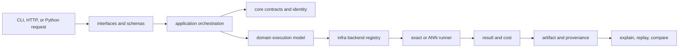
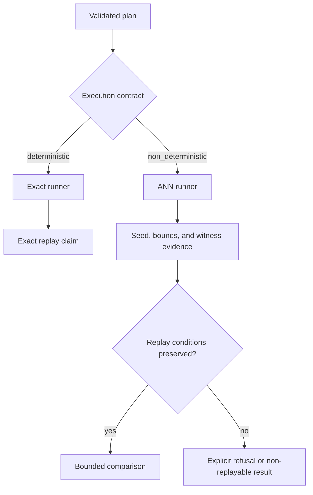
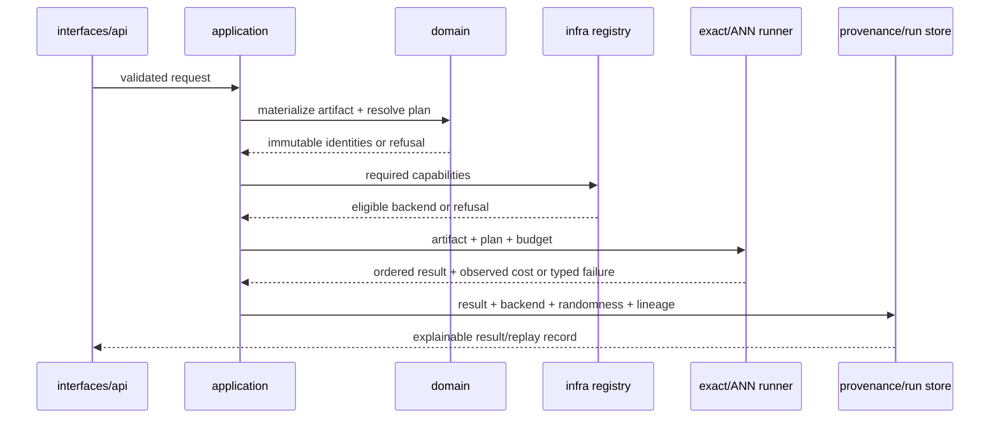

# Module Map

`bijux-canon-index` governs vector execution. It turns an explicit request,
intent, contract, mode, and budget into a validated plan and an explainable
result. Backend differences remain visible through capabilities, provenance,
and refusal states instead of being flattened behind a generic search call.



## Ownership by module

| Module | Owns | Use it when |
| --- | --- | --- |
| `core` | Stable request/result primitives, execution plans, identity, ABI contracts, and typed errors | Defining the execution contract or integrating a new stable primitive |
| `domain.algorithms` | Exact and approximate planning and execution semantics | Reasoning about backend-independent search behavior |
| `domain.requests` | Request execution, comparison, and execution diffs | Applying a declared request to an execution environment |
| `domain.artifact` | Build plans, artifact lifecycle, validation, and integrity | Materializing a reusable corpus or execution artifact |
| `domain.provenance` | Provenance records, explanation, replay, and comparison evidence | Establishing what produced a result and whether it can be reproduced |
| `domain.non_determinism` | ANN profiles, randomness declarations, witness policy, and bounded quality | Running approximate retrieval without overstating replay guarantees |
| `domain.drift` | Index and execution drift detection | Deciding whether two runs remain comparable |
| `application` | Vector execution engine and orchestration across contracts, stores, and runners | Invoking complete package use cases |
| `infra.adapters` and `infra.embeddings` | Vector-store and embedding integrations | Connecting execution to a concrete backend |
| `infra.runners` | Exact and ANN runner implementations | Adding or selecting an execution mechanism |
| `infra.plugins` | Plugin loading and registration | Extending supported backends without changing domain contracts |
| `interfaces` | Module CLI, schemas, configuration, rendering, and boundary error mapping | Crossing a command or serialization boundary |
| `api.v1` | FastAPI routes for discovery, materialization, execution, and replay | Exposing the governed contract over HTTP |

## Contract progression

The package preserves distinct states instead of returning an unqualified list
of neighbors:

```text
ExecutionRequest
  -> ExecutionPlan
  -> ExecutionSession
  -> ExecutionResult
  -> ExecutionArtifact
```

Planning validates declared intent and budget against backend capability.
Execution records observed cost and backend identity. Materialization adds an
artifact fingerprint and provenance. Replay then compares recorded identity,
parameters, and contract before it compares results.

## Exact and approximate paths



A non-deterministic run is not made deterministic by recording its output.
Replayability depends on the declared randomness, backend and index identity,
parameters, and witness policy. Strict mode refuses unsupported combinations;
bounded and exploratory modes permit only the loss posture they declare.

## Walk one query through the architecture



Backend selection occurs only after request, artifact and capability invariants
are known. The runner does not decide whether its own behavior satisfies the
declared contract, and the interface does not translate a refusal into an
empty successful neighbor list.

## Dependency direction

| Layer | May know | Must not own |
| --- | --- | --- |
| `core` | stable primitives, identities, contracts and typed errors | backend SDKs, HTTP/CLI translation or mutable stores |
| `domain` | core vocabulary and backend-independent execution semantics | provider credentials, transport behavior or interface defaults |
| `application` | use-case orchestration across domain protocols and supplied implementations | hidden scoring/capability policy outside domain records |
| `infra` | domain protocols plus concrete backends, runners, plugins and stores | permission to weaken the request, artifact, budget or provenance contract |
| `interfaces` / `api.v1` | application entry points, DTOs and error mapping | ranking semantics or backend-specific workarounds |

Shared behavior across two backends belongs in domain or conformance contracts.
An adapter remains responsible for native translation and failure detail, not
for inventing a package-wide execution rule.

## Package boundaries

`bijux-canon-ingest` prepares documents and chunks. `bijux-canon-index` begins
where vector execution needs declared capabilities, budgets, provenance, and
replay semantics. Evidence interpretation belongs to `bijux-canon-reason`, and
cross-package run authority belongs to `bijux-canon-runtime`.

## Source and proof

- [`core`](https://github.com/bijux/bijux-canon/tree/main/packages/bijux-canon-index/src/bijux_canon_index/core) defines the stable execution vocabulary.
- [`domain`](https://github.com/bijux/bijux-canon/tree/main/packages/bijux-canon-index/src/bijux_canon_index/domain) owns algorithm, artifact, provenance, and drift semantics.
- [`infra`](https://github.com/bijux/bijux-canon/tree/main/packages/bijux-canon-index/src/bijux_canon_index/infra) contains backend adapters, runners, and stores.
- [`tests`](https://github.com/bijux/bijux-canon/tree/main/packages/bijux-canon-index/tests) covers capability refusal, conformance, provenance, replay, and boundary behavior.
