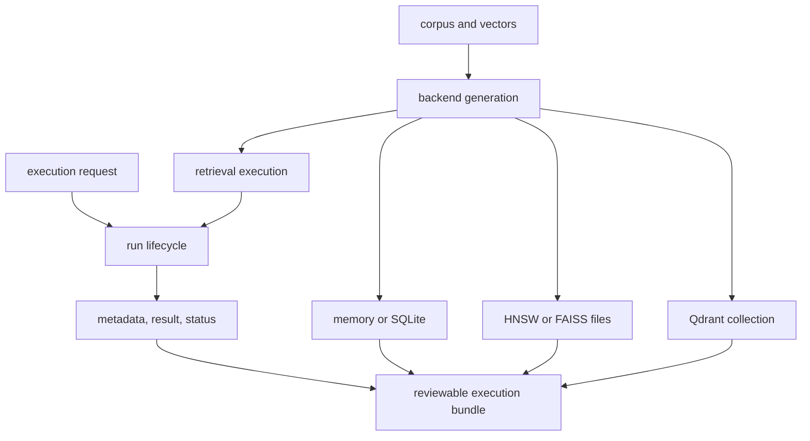
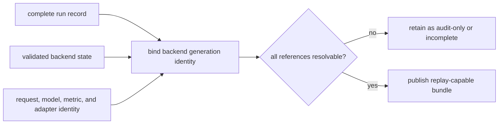

# State and Persistence

Index has two independent persistence responsibilities: backend state makes a
corpus searchable; run state makes one execution reviewable. Retaining one
without the other can preserve an audit record without preserving replayable
search, or preserve searchable vectors without preserving why a result was
accepted.

## Persistence Domains



The arrows into the bundle are identity links, not necessarily copied payloads.
A run directory does not contain a remote collection or native index unless an
export workflow explicitly includes it.

## Run Lifecycle

The default root is `artifacts/bijux-canon-index/runs`, configurable through
`BIJUX_CANON_INDEX_RUN_DIR`; `BIJUX_VEX_RUN_DIR` is the compatibility fallback.

```text
<run-root>/<run-id>/
├── metadata.json
├── result.json
└── status.json
```

The store publishes `incomplete` status before metadata. Successful
finalization writes the result before changing status to `complete`. Failure
records `failed` status with optional reason and details. Each JSON file uses a
temporary sibling and atomic replacement; the directory is not one filesystem
transaction.

`status=complete` is the commit signal. Load through `RunStore`, which refuses
missing, incomplete, and failed runs. The presence of `result.json` alone is not
success evidence.

## Backend State Inventory

| Backend or subsystem | State authority | Persistence contract | Recovery unit |
| --- | --- | --- | --- |
| memory | current process | none | rebuild from prepared corpus |
| SQLite | local database | transactional local corpus and vector state | consistent database backup or rebuild |
| embedding cache | local SQLite cache | reconstructible derived vectors | evict and recompute from pinned embedder inputs |
| HNSW | metadata plus native index directory | metadata and native files must match | consistent generation export or rebuild |
| FAISS | native `.faiss` file plus metadata | load-time backend/version identity checks | consistent file and metadata pair or rebuild |
| Qdrant | external service collection | deployment-owned durability and tenancy | service snapshot plus collection identity |

The pgvector-named adapter currently uses SQLite-backed resources and is not a
PostgreSQL persistence boundary.

## Execution Bundle Publication



An export must state whether it is audit-only or replay-capable. A replay-capable
bundle resolves the corpus and backend generation, native or service state,
normalized request, capability decision, adapter versions, result, provenance,
and completion classification. Copying only the run JSON preserves neither the
vectors nor the backend state.

## Retention And Recovery

| Condition | Required response |
| --- | --- |
| `incomplete` or `failed` run | retain for diagnosis or remove under policy; never relabel complete |
| complete run with missing backend state | classify audit-only and refuse replay |
| native file/metadata mismatch | quarantine generation and rebuild |
| changed Qdrant collection identity | refuse equality claim and restore the recorded generation if available |
| embedding cache corruption | evict and recompute; do not promote cache to source authority |
| working-directory drift | configure absolute deployment roots and verify them at startup |

Back up each backend using its consistency mechanism. Set the run root
explicitly, retain completed evidence for the required audit period, and test
restore—not only backup creation—before claiming recoverability.

See [artifact contracts](../interfaces/artifact-contracts.md) for record fields
and [failure recovery](../operations/failure-recovery.md) for operator actions.
