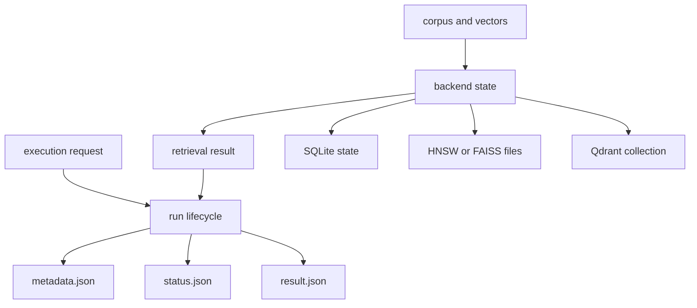

# State and Persistence

Index persists two different kinds of state: backend state that makes a corpus
searchable, and run evidence that makes an execution reviewable. They have
different lifecycles and should not share retention assumptions.

## Persistence Map



## Run Records

The default run root is `artifacts/bijux-canon-index/runs`. Set
`BIJUX_CANON_INDEX_RUN_DIR` to move it; the legacy
`BIJUX_VEX_RUN_DIR` variable remains a compatibility fallback.

Each run has its own directory:

```text
<run-root>/<run-id>/
├── metadata.json
├── result.json
└── status.json
```

At start, the store writes `status.json` with `incomplete` and then writes
`metadata.json`. Successful finalization writes `result.json` before changing
status to `complete`. A failed execution changes status to `failed` and may add
a reason and details. Each JSON file is written through a temporary sibling and
atomic replacement.

The loader returns only complete runs. Missing, incomplete, or failed runs
raise a validation error instead of presenting partial output as replayable
evidence.

## Backend State

| Backend or subsystem | Typical state | Persistence notes |
| --- | --- | --- |
| memory | process-local records and vectors | lost when the process exits |
| SQLite | `artifacts/bijux-canon-index/state/session.sqlite` by default | transactional local corpus and vector state |
| embedding cache | `artifacts/bijux-canon-index/cache/embeddings.sqlite` | reusable derived values; safe to rebuild from sources |
| HNSW | SQLite metadata plus files under an index directory | native index files and metadata must remain consistent |
| FAISS | `.faiss` index plus metadata | adapter validates backend/version metadata when loading |
| Qdrant | service-owned collection state | availability, backup, and durability belong to the service deployment |

The optional pgvector-named adapter is excluded from the frozen v1 contract and
currently delegates to SQLite-backed resources. Do not plan production
durability around it as if it were a PostgreSQL integration.

## Atomicity Boundaries

Run JSON files are individually atomic, but a run directory is not a filesystem
transaction. Status is the commit signal: consumers should require
`status=complete` and use the package loader rather than infer success from the
presence of `result.json`.

Native backend files and run evidence are also separate. Copying a run record
does not copy the corpus or vector index needed to replay it. Export workflows
must preserve artifact identity and the corresponding backend state, or state
clearly that only an audit record is being retained.

## Retention and Recovery

- Retain completed run directories for the audit period required by the
  consuming system.
- Investigate `incomplete` and `failed` records; do not silently relabel them.
- Back up SQLite, native index files, and service collections using their
  backend-specific consistency procedures.
- Treat the embedding cache as reconstructible unless an application has made
  it part of a stronger evidence contract.
- Set the run root explicitly in deployments so working-directory changes do
  not redirect evidence.

See [artifact contracts](../interfaces/artifact-contracts.md) for exported
record fields and [failure recovery](../operations/failure-recovery.md) for
operator actions.
