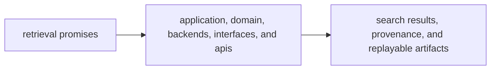

# Capability Map

The capability map for `bijux-canon-index` should let a reviewer trace retrieval promises back to the modules that execute, compare, and expose search behavior. If a retrieval promise has no visible home, the package contract is weaker than it looks.

## Capability Flow

This page should show index capability as a concrete path from retrieval claim
to execution surface to reviewable output. Readers should not have to infer
where search behavior really lives.

## Capability To Code

- `application/` and package workflows coordinate search execution at the package seam
- `domain/`, backend modules, and retrieval services own embedding, retrieval, and comparison behavior
- `interfaces/` and `apis/` own the surfaces that callers depend on when retrieval becomes a contract

## Visible Outputs

- embeddings and index state tied to prepared input
- retrieval results with provenance and replay context
- caller-facing search artifacts and schemas

## Design Pressure

Retrieval contracts become fragile when provenance and replay claims cannot be
traced back to named code areas. The package has to keep capability, module,
and output aligned tightly enough for review.
