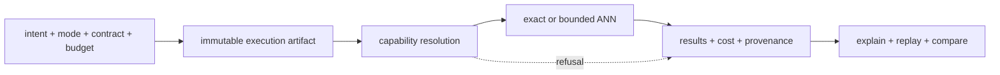

# Capability Map

`bijux-canon-index` makes vector execution explicit from request through
replay. Capabilities are admitted by declared contracts and backend evidence;
module presence alone does not make an adapter part of the supported v1
surface.

```mermaid
flowchart LR
    request["intent + mode + contract + budget"]
    materialize["immutable execution artifact"]
    resolve["capability resolution"]
    execute["exact or bounded ANN"]
    record["results + cost + provenance"]
    review["explain + replay + compare"]

    request --> materialize --> resolve --> execute --> record --> review
    resolve -. refusal .-> record
```

## Governed execution capabilities

| Capability | Owning area | Reviewable output |
| --- | --- | --- |
| Request normalization | `domain/requests/` and interface schemas | validated intent, mode, contract, budget, metric, and randomness policy |
| Artifact materialization | `domain/artifact/` and application orchestration | immutable corpus/vector/configuration identity |
| Capability discovery | registries and capabilities report | eligible contracts, metrics, dimensions, ANN support, consistency, and exclusions |
| Exact scoring | algorithms and exact-capable adapters | stable tie order, ordered result IDs, scores, and execution cost |
| ANN candidate execution | `domain/non_determinism/` and ANN adapters | parameters, seed/sources, candidate policy, decision trace |
| Optional exact rescore | non-deterministic plan actions | explicit candidate-to-final ranking path |
| Budget enforcement | request budgets and performance contracts | refusal or partial result with the breached dimension |
| Transaction and authorization guards | `contracts/` | explicit misuse or denial before mutation |

## Evidence and review capabilities

| Capability | Owning area | Reviewable output |
| --- | --- | --- |
| Fingerprinting | core identity and provenance modules | vector, configuration, backend, determinism, plan, and result identities |
| Run lifecycle | `infra/run_store.py` | incomplete, failed, or complete three-file run directory |
| Explanation | query introspection and result records | document, chunk, vector, metric, score, rank, artifact, and execution join |
| Replay | `domain/provenance/replay.py` and application support | match decision, fingerprints, mismatch details, randomness sources |
| Drift analysis | `domain/drift/` and comparison requests | backend, artifact, parameter, and execution differences |
| Plugin discovery | plugin entry points and registry contracts | provider/backend identity and capability declaration |
| Public execution | CLI module and HTTP v1 | structured results or typed governed refusals |

## Backend boundary

Memory and SQLite provide the local supported persistence baseline. ANN and
optional vector-store adapters add capabilities only when installed,
registered, reachable, and conformant. Remote backends, asynchronous services,
and streaming search are excluded from the v1 contract; pgvector remains
experimental and outside the v1 freeze.

## Choosing an execution path

- Use deterministic strict execution when exact equality and replay are
  required.
- Use bounded ANN only when quality, resource, randomness, and divergence
  policy are declared before execution.
- Inspect capabilities before materialization or execution; do not discover
  incompatibility from a failed production query.
- Retain the execution artifact and complete run directory together when a
  decision must be audited.
- Treat explanation and replay as provenance evidence, not proof of corpus
  quality, semantic relevance, or factual truth.

The [execution invariants](../quality/invariants.md) define refusal boundaries,
and [known limitations](../quality/known-limitations.md) distinguish governed
execution from stronger claims the package cannot make.
