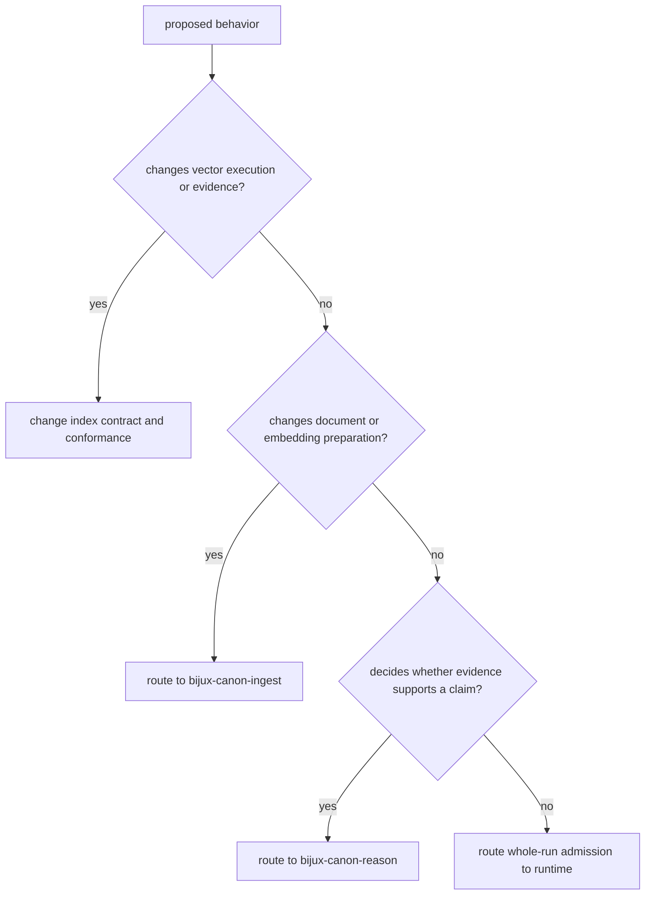

# Change Principles

An index change is acceptable when callers can still distinguish requested
intent from actual execution and can inspect the evidence behind a result.
Faster or broader backend support is not an improvement if it weakens
exactness, refusal, isolation, provenance, or replay claims.

## Invariants To Preserve

| Invariant | Why it matters |
| --- | --- |
| intent, mode, and execution contract remain distinct | user purpose, enforcement posture, and promised behavior are different decisions |
| capability is validated before execution | backend names and installed modules do not prove a request can be honored |
| strict exact work refuses approximation | a plausible neighbor set cannot satisfy an exact contract |
| approximation retains its loss contract | parameters, randomness, witness, quality, and budgets qualify ANN results |
| scores have stable metric and tie semantics | ordering must be comparable across runs and backends |
| artifacts and state carry fingerprints | replay requires more than final IDs and scores |
| isolation, authorization, and transaction scope remain explicit | storage reuse must not cross run or tenant authority |
| unsupported surfaces stay unsupported | source presence does not promote remote, async, streaming, or experimental paths into v1 |

## Route The Change

An integration can span these boundaries without moving authority. A new
embedding fingerprint may originate in ingest, become part of the index
artifact and replay envelope, and later appear in reasoning provenance.

## Change Evidence

| Changed surface | Evidence required before the new claim is credible |
| --- | --- |
| scoring, metric, or tie policy | domain laws and cross-backend ordered-result conformance |
| execution request or plan | canonical serialization, immutability, validation, and fingerprint tests |
| exact or ANN runner | capability checks, exact-versus-ANN comparison, loss report, and drift evidence |
| store or adapter | CRUD, transaction, isolation, corruption, retry, and replay conformance |
| budget or partial result | exhausted-dimension classification and refusal/partial-result scenarios |
| artifact or run schema | versioning, migration, portability, provenance, and golden replay |
| HTTP contract | DTO rejection, OpenAPI drift, endpoint behavior, and idempotency evidence |
| performance or quality claim | named dataset, backend, parameters, dependency versions, hardware, recall, and latency |

The canonical distribution intentionally publishes no console script. Do not
add a command merely to mirror `bijux-vex`; first decide whether a canonical
command contract is warranted and carry its packaging, behavior, and migration
evidence together.

## Refusal Conditions

Do not merge a change that silently falls back from exact to approximate,
labels a backend by aspiration rather than implementation, accepts a partial
budget result as ordinary top-`k`, or treats matching output IDs as sufficient
replay evidence.

Use [domain language](domain-language.md) for execution terms and
[test strategy](../quality/test-strategy.md) for conformance layers.
