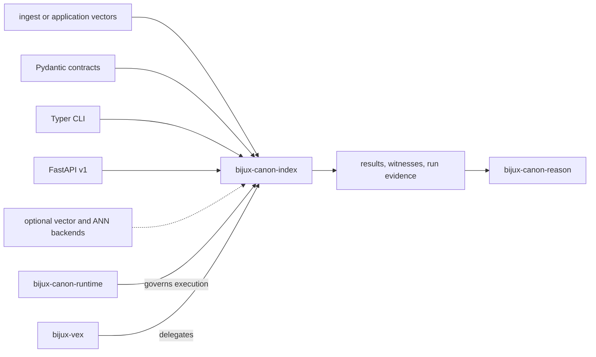

# Dependencies and Adjacencies

`bijux-canon-index` turns prepared vectors and declared execution intent into
ordered results with budgets, provenance, and replay evidence. Storage and ANN
libraries implement capabilities behind that contract; they do not define the
meaning of an accepted execution.

## Dependency shape

The core installation provides contract, CLI, and HTTP dependencies. Native
and remote backend integrations are capability-selected optional resources.

## Dependency roles

| Dependency family | Role | Contractual limit |
| --- | --- | --- |
| Pydantic | Strict request, report, artifact, and interface models | Model validation does not decide acceptable approximation or replay |
| Typer | Canonical module CLI | Command parsing cannot bypass the execution engine's refusal and budget gates |
| FastAPI | Versioned HTTP transport | The host still owns identity, authorization, transport security, and quotas |
| SQLite and local files | Ledger, local vector state, cache, and run records | Each persistence domain has separate identity and lifecycle |
| HNSW, FAISS, Qdrant, and other optional adapters | Native or service-backed vector capabilities | Availability must be discovered; metric, dimension, exactness, consistency, and replay claims remain explicit |
| Plugin entry points | Register controlled backend behavior | Loaded Python executes in-process and is neither trusted nor sandboxed by registration |

The pgvector-named adapter is excluded from the frozen v1 surface and does not
constitute a PostgreSQL deployment contract.

## Canonical package adjacencies

### Ingest

Ingest owns source normalization, chunk geometry, source identity, and its
compact local retrieval path. Index receives prepared vectors and metadata; it
must not repair preparation defects by silently changing content or identity.

### Reason

Reason may cite and interpret retrieved evidence, but it does not own the
search plan, backend behavior, distance semantics, candidate ordering, or ANN
quality evidence. An index result establishes what a declared execution
returned, not whether a proposition is true.

### Runtime

Runtime can select, constrain, observe, and accept an index operation as part
of a larger flow. Index retains ownership of vector execution artifacts,
capability refusal, witness evidence, and retrieval replay semantics.

### Compatibility packages

`bijux-vex` preserves a legacy import and command surface by delegation. New
features belong in the canonical package first. Compatibility adapters must
not introduce a second execution meaning or divergent artifact schema.

## Cross-boundary evidence

Every downstream handoff binds the result to:

- artifact ID, content/configuration fingerprint, metric, and dimension;
- intent, contract, mode, request, and resolved budgets;
- backend and algorithm identity, capabilities, parameters, and version;
- exact or approximate posture, randomness declaration, and index identity;
- ordered neighbors, scores, observed cost, witnesses, and refusal state;
- run-record identity and the persistence resources required for replay.

See [integration seams](../architecture/integration-seams.md) for adapter-level
handoffs and [artifact contracts](../interfaces/artifact-contracts.md) for the
durable evidence model.
