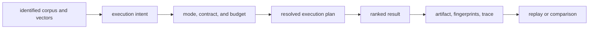

# Domain Language

Index governs vector retrieval. Its language distinguishes stored corpus state,
the contract under which a query may execute, the ranked result, and the
evidence needed to explain or replay that execution.

Backend selection is deliberately downstream of intent and contract. A store
name cannot substitute for an exactness promise, loss profile, resource budget,
or replay posture.

## Corpus and Retrieval

| Term | Meaning |
| --- | --- |
| document | source identity and text admitted to the corpus |
| chunk | document-owned text span used as the unit of retrieval |
| vector | dimension-checked numeric values owned by one chunk |
| model specification | model identity, dimension, vendor, and version |
| vector store | adapter that persists or searches vectors |
| exact retrieval | exhaustive scoring under deterministic execution |
| approximate retrieval | ANN candidate selection with declared quality and randomness bounds |
| result | ranked document/chunk/vector row with score and artifact identity |

A vector store is an implementation choice. It does not define the execution
contract, and “stored successfully” does not imply that exact or approximate
query requirements can be satisfied.

## Execution Authority

| Term | Meaning |
| --- | --- |
| execution artifact | corpus and index definition bound to an execution contract |
| execution contract | `deterministic` or `non_deterministic` guarantee |
| execution intent | reason the caller requires exactness, reproducibility, exploration, or another posture |
| execution mode | refusal posture: `strict`, `bounded`, or `exploratory` |
| execution budget | declared limits on latency, memory, error, vectors, distance work, and probes |
| execution plan | validated algorithm and backend decision for one request |
| refusal | governed rejection because the declared contract cannot be honored |

Intent explains why a loss profile is acceptable. Mode defines how strictly the
runtime must enforce it. Contract states the promised behavior. These are
separate fields and should never be collapsed into a backend name such as
“HNSW mode.”

## Approximation and Quality

| Term | Meaning |
| --- | --- |
| ANN | approximate nearest-neighbor retrieval |
| candidate pool | vectors selected for later exact scoring or reranking |
| witness | exact comparison used to measure an approximate decision |
| target recall | requested quality threshold for ANN behavior |
| decision trace | recorded non-deterministic choices made during execution |
| low-signal refusal | rejection when score or distance evidence is too weak |
| replay-strict | policy that refuses replay after index or parameter drift |

A witness measures approximation; it does not convert an approximate run into
an exact run. A seed can make some random choices reproducible, but it cannot
erase backend, index, corpus, or parameter drift.

## Identity and Evidence

| Term | Meaning |
| --- | --- |
| artifact ID | caller-facing identity of materialized execution state |
| correlation ID | interface lifecycle identity and on-disk run prefix |
| execution ID | runtime identity of the resolved plan and result set |
| fingerprint | content-derived identity for vectors, configuration, backend, determinism, or results |
| explanation | join from one result to document, chunk, vector, artifact, score, and execution |
| replay | re-execution evaluated under the retained contract and equivalence policy |
| comparison | structural and ranking differences between executions or artifacts |

“Same results” means only the compared result projection matched. “Replayable”
requires the retained artifact, contract, inputs, backend conditions, and
fingerprints needed by the replay policy.
