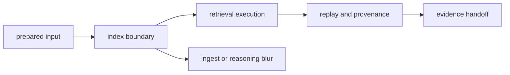

# Foundation

Open this section when you need the durable answer to why `bijux-canon-index` owns retrieval behavior instead of leaving search semantics smeared across ingest, reasoning, or runtime. These pages should make the search boundary easy to defend before anyone argues about code shape.

## Boundary Model

The foundation story for index has to make retrieval feel like a first-class
responsibility. Prepared input arrives from ingest, search happens here through
explicit contracts, and replayable evidence leaves for later interpretation.
That line is what keeps search from becoming hidden glue.

## Read These First

- open [Ownership Boundary](https://bijux.io/bijux-canon/03-bijux-canon-index/foundation/ownership-boundary/) first when retrieval logic could be confused with ingest preparation or reasoning meaning
- open [Package Overview](https://bijux.io/bijux-canon/03-bijux-canon-index/foundation/package-overview/) when you need the shortest stable description of the package role
- open [Lifecycle Overview](https://bijux.io/bijux-canon/03-bijux-canon-index/foundation/lifecycle-overview/) when the question is how prepared input becomes replayable retrieval output

## The Mistake This Section Prevents

The most common mistake here is treating vector execution as a background implementation detail instead of a contract-defining package responsibility.

## First Proof Check

- `packages/bijux-canon-index/src/bijux_canon_index` for the owned retrieval implementation boundary
- `packages/bijux-canon-index/apis` for the schema surfaces tied to caller expectations
- `packages/bijux-canon-index/tests` for replay and provenance proof

## Pages In This Section

- [Package Overview](https://bijux.io/bijux-canon/03-bijux-canon-index/foundation/package-overview/)
- [Scope and Non-Goals](https://bijux.io/bijux-canon/03-bijux-canon-index/foundation/scope-and-non-goals/)
- [Ownership Boundary](https://bijux.io/bijux-canon/03-bijux-canon-index/foundation/ownership-boundary/)
- [Repository Fit](https://bijux.io/bijux-canon/03-bijux-canon-index/foundation/repository-fit/)
- [Capability Map](https://bijux.io/bijux-canon/03-bijux-canon-index/foundation/capability-map/)
- [Domain Language](https://bijux.io/bijux-canon/03-bijux-canon-index/foundation/domain-language/)
- [Lifecycle Overview](https://bijux.io/bijux-canon/03-bijux-canon-index/foundation/lifecycle-overview/)
- [Dependencies and Adjacencies](https://bijux.io/bijux-canon/03-bijux-canon-index/foundation/dependencies-and-adjacencies/)
- [Change Principles](https://bijux.io/bijux-canon/03-bijux-canon-index/foundation/change-principles/)

## Leave This Section When

- leave this section for [Interfaces](https://bijux.io/bijux-canon/03-bijux-canon-index/interfaces/) when the live question is a command, API, artifact, or import contract
- leave this section for [Operations](https://bijux.io/bijux-canon/03-bijux-canon-index/operations/) when the issue is running, diagnosing, or releasing the package
- leave this section for [Quality](https://bijux.io/bijux-canon/03-bijux-canon-index/quality/) when you are already convinced about the boundary and need proof that it survives change

## Design Pressure

If retrieval is described as just backend detail or just caller convenience,
the package has already lost its reason to exist. This section has to keep
execution, provenance, and handoff visibly tied together.
