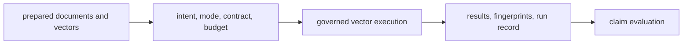

# Foundation

`bijux-canon-index` owns governed vector execution. It receives identified
documents and vectors, binds them to an immutable execution artifact, selects
a capable backend, executes an exact or explicitly bounded plan, and retains
the provenance needed to explain and compare the result.

## Authority boundary

```mermaid
flowchart LR
    ingest["prepared documents and vectors"]
    request["intent, mode, contract, budget"]
    index["governed vector execution"]
    evidence["results, fingerprints, run record"]
    reason["claim evaluation"]

    ingest --> request --> index --> evidence --> reason
```

Index does not repair source normalization, decide whether a passage supports
a claim, or schedule an end-to-end workflow. It establishes a narrower and
testable fact: which vector operation ran under which declared contract, and
which ordered results it produced.

## Core commitments

| Commitment | Meaning | Evidence |
| --- | --- | --- |
| Declared intent | exact validation, reproducible research, exploration, and production retrieval are distinguishable | normalized request and run metadata |
| Capability negotiation | a backend is eligible only when it satisfies the requested contract and metric | capabilities report and resolved plan |
| Deterministic baseline | strict deterministic work uses exact scoring and refuses incompatible execution | artifact contract, plan fingerprint, ordered results |
| Honest approximation | ANN behavior carries randomness, error, resource, witness, and replay policy | approximation report and decision trace |
| Addressable execution | artifacts, runs, correlations, backends, indexes, and parameters have recorded identities | response, ledger, and run directory |
| Governed comparison | replay evaluates fingerprints and equivalence policy, not result resemblance alone | replay or comparison payload |

## What the result does not prove

An `ExecutionArtifact` and complete run record establish execution provenance.
They do not establish that the corpus is complete, that the embedding captures
the intended meaning, that a neighbor is relevant, or that a retrieved passage
supports a conclusion. Those claims require source and reasoning evidence.

## Supported boundary and exclusions

The v1 boundary centers on synchronous local governed execution. Remote
backends, asynchronous services, and streaming search are excluded from the v1
contract. The pgvector adapter remains experimental and is excluded from the
v1 freeze. Adapter code may exist without becoming a supported contract; use
capability discovery and the documented exclusions rather than inferring
support from module presence.

## Read by decision

| Decision | Guide |
| --- | --- |
| Understand the package in one pass | [Package overview](package-overview.md) |
| Decide whether work belongs here | [Ownership boundary](ownership-boundary.md) and [Scope and non-goals](scope-and-non-goals.md) |
| Match capabilities to user intent | [Capability map](capability-map.md) |
| Follow artifact and run lifecycles | [Lifecycle overview](lifecycle-overview.md) |
| Use terms such as contract, mode, artifact, and replay precisely | [Domain language](domain-language.md) |
| Understand adjacent package responsibilities | [Repository fit](repository-fit.md) and [Dependencies and adjacencies](dependencies-and-adjacencies.md) |
| Review a contract-changing proposal | [Change principles](change-principles.md) |
