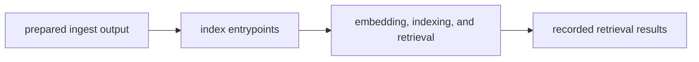

# Lifecycle Overview

The index lifecycle starts with prepared ingest output and ends when retrieval behavior has been executed, recorded, and exposed clearly enough for reasoning or runtime to inspect.

## Lifecycle Flow

This page should show retrieval as one continuous package-owned flow. Readers
should be able to see how prepared input becomes replayable search behavior
without drifting into reasoning or runtime authority.

## Lifecycle Shape

- prepared input reaches index entrypoints and package workflows
- embedding, indexing, retrieval, and comparison logic execute under named module ownership
- results leave the package with provenance and replay context attached

## Handoff Point

The lifecycle stops before claim meaning or run authority. `bijux-canon-reason` and `bijux-canon-runtime` own those next decisions.

## Design Pressure

If the lifecycle cannot stop at retrieval results with provenance attached,
index is either under-explained or taking on downstream meaning. The package
has to end with inspectable search behavior, not with an implicit next step.
