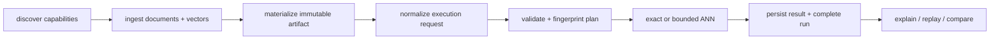

# Lifecycle Overview

The index lifecycle separates corpus admission, artifact materialization, and
execution. A query cannot become a governed result until its artifact and
backend capabilities agree with the declared contract.

```mermaid
flowchart LR
    discover["discover capabilities"]
    admit["ingest documents + vectors"]
    materialize["materialize immutable artifact"]
    request["normalize execution request"]
    plan["validate + fingerprint plan"]
    execute["exact or bounded ANN"]
    finalize["persist result + complete run"]
    review["explain / replay / compare"]

    discover --> admit --> materialize --> request --> plan --> execute --> finalize --> review
```

## Admission and materialization

1. Inspect the active engine, backend, metric, ANN, store, plugin, and resource
   capabilities.
2. Admit documents with supplied vectors or an explicitly selected embedding
   provider.
3. Materialize an artifact that binds ordered vector content, corpus identity,
   metric, scoring version, construction parameters, index configuration, and
   deterministic or non-deterministic contract.
4. Refuse attempts to rebind an existing artifact identity to a different
   execution contract.

## Execution

1. Normalize intent, mode, contract, budget, identity, and randomness policy.
2. Resolve the requested artifact and reject request/artifact disagreement.
3. Validate metric, dimension, exact/ANN, replay, and resource requirements
   against backend capabilities.
4. Build and fingerprint the immutable execution plan.
5. Execute exact scoring, or ANN candidate retrieval with its declared
   parameters and optional exact rescoring.
6. Collect ordered IDs, scores, cost, warnings, stability, replayability, and
   approximation evidence.

## Finalization and review

The application records the execution in the ledger and writes the run
directory. A run begins `incomplete`, becomes `failed` with a reason on a
governed failure, or becomes `complete` only after its result file is durable.
Only complete runs can support normal replay loading.

Explanation resolves a result through document, chunk, vector, score, artifact,
backend, and execution identity. Replay validates recorded contracts and
fingerprints before comparing output. Deterministic mismatch is failure;
non-deterministic divergence is interpreted only through the policy declared
before the original execution.

## Persistence lifecycles

The execution ledger, vector store, execution artifact, and run directory are
different records. They may share identities but do not replace one another.
For auditable retention, preserve the artifact definition and complete run
directory together, plus access to any external vector-store state required by
the adapter.

The lifecycle ends with reviewable retrieval evidence. Claim formation begins
in reason; final workflow acceptance begins in runtime.
