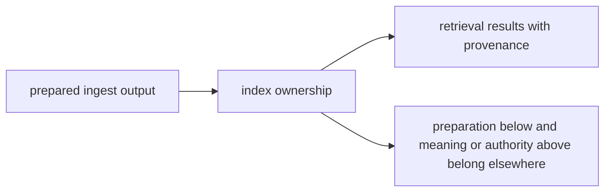

# Ownership Boundary

`bijux-canon-index` owns retrieval behavior after ingest has already prepared the material. Use it when search logic looks close enough to either preprocessing below or reasoning above to blur the package seam.

## Boundary Map

This page should let a reader separate search behavior from both source cleanup
and later interpretation. The package boundary holds when retrieval can be
explained as its own owned step.

## Use This Boundary Test

- keep the work here when it changes embedding, indexing, retrieval, provenance, or replay behavior
- move the work down to `bijux-canon-ingest` when the change is really about preparing source material before search
- move the work upward when the issue is about claim meaning, workflow policy, or governed run acceptance

## Borderline Example

A new retrieval comparator belongs here. A new rule for how a claim should interpret retrieved evidence belongs in reasoning instead.

## First Proof Check

- `packages/bijux-canon-index/src` for the owned implementation boundary
- `packages/bijux-canon-index/tests` for proof that the boundary survives change
- neighboring handbook roots in ingest, reason, and runtime when the work still looks plausible elsewhere

## Design Pressure

The pressure on index is to keep retrieval logic explicit instead of hiding it
in preprocessing, adapters, or downstream judgment. If the boundary blurs, the
package stops paying for itself.
