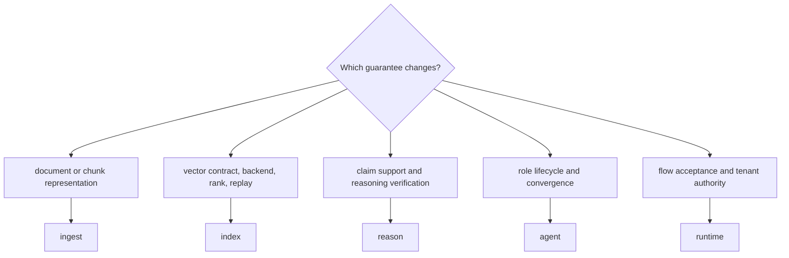

# Ownership Boundary

Index authority is execution-contract authority over vectors. It binds a
request and immutable artifact to an eligible backend, records what happened,
and evaluates later replay without claiming what the result means.

```mermaid
flowchart TD
    change{"Which guarantee changes?"}
    prepare["document or chunk representation"]
    execute["vector contract, backend, rank, replay"]
    support["claim support and reasoning verification"]
    roles["role lifecycle and convergence"]
    flow["flow acceptance and tenant authority"]

    change --> prepare --> ingest["ingest"]
    change --> execute --> index["index"]
    change --> support --> reason["reason"]
    change --> roles --> agent["agent"]
    change --> flow --> runtime["runtime"]
```

## Decision table

| Change | Owner | Reason |
| --- | --- | --- |
| change normalization or chunk overlap | ingest | changes prepared content and identity |
| change stable tie-breaking or metric semantics | index | changes governed ranking behavior |
| add an ANN parameter to plan identity and replay comparison | index | changes approximation and provenance contract |
| decide whether a passage entails a proposed statement | reason | changes support interpretation |
| run a verifier role again after a veto | agent | changes workflow progression |
| accept bounded replay for a complete tenant flow | runtime | changes final workflow authority |

## Ingest and index retrieval

Ingest supplies a compact local BM25/NumPy path for document preparation,
evaluation, and extractive citation. Index becomes the owner when retrieval
requires an immutable execution artifact, explicit exact/ANN contract,
capability-selected backend, governed budget, cross-run provenance, or replay
comparison.

The handoff should retain document, chunk, vector, embedding/configuration, and
corpus identity. Index must not silently clean or rechunk input to satisfy a
backend; doing so would make artifact identity dishonest.

## Index and reason evidence

Index can explain why a result occupied a rank by joining its query, vector,
metric, score, backend, artifact, and execution. Reason decides whether the
retrieved content supports a claim. A result explanation is necessary
provenance, but it is not claim verification.

## Ranking custody

```mermaid
flowchart LR
    prepared["prepared document + chunk + vector identity"]
    artifact["immutable execution artifact"]
    request["intent + contract + metric + budget"]
    plan["eligible backend + exact/ANN plan"]
    candidates["candidate execution"]
    result["ordered result + cost + provenance"]
    support["reason-owned support decision"]

    prepared --> request --> artifact --> plan --> candidates --> result
    result -. "evidence handoff" .-> support
```

Index owns the solid path from artifact materialization through ranking. It
does not own the prepared text/vector semantics before the artifact or the
claim-support decision after the result.

## Minimum retrieval handoff

| Field | Why the consumer needs it |
| --- | --- |
| request, artifact and execution identities | binds the result to immutable inputs and declared intent |
| document/chunk/vector and embedding identities | preserves the preparation objects that were ranked |
| metric, dimensions and normalization assumptions | makes score semantics interpretable |
| backend, capability report and implementation identity | explains eligibility and operational behavior |
| exact/ANN classification, parameters and randomness sources | prevents approximate output from being described as exact |
| candidate, rescore and final ordering path | exposes how the final rank was produced |
| budget/cost, partial status and typed failures | prevents truncated work from appearing complete |
| provenance, fingerprints and replay policy | permits later explanation and comparison |

Reason may select exact bytes from a returned chunk and decide whether they
support a claim. It must retain this retrieval packet rather than replacing it
with rank alone.

## Resolve ambiguous failures

| Symptom | First record to inspect | Owner when that record is false |
| --- | --- | --- |
| chunk text or vector differs before execution | preparation identity and embedding specification | ingest |
| declared metric cannot run on the artifact dimensions | request/artifact validation and capability decision | index |
| ANN candidate set changes outside its declared envelope | plan, randomness, backend and replay comparison | index |
| correct ranked result is cited with the wrong byte span | evidence/support record | reason |
| correct index result is lost or reordered during role merge | agent shard/merge lineage | agent |
| valid result is prohibited by flow/tenant policy | runtime authority and arbitration | runtime |

Detection location does not transfer ownership. Retain the upstream identity
and route the defect to the first false invariant.

## Ownership test

Ask which record must change for the behavior to become correct. If it is a
prepared document or chunk, use ingest. If it is an execution request,
artifact, backend capability, score, run record, or replay comparison, use
index. If it is a support reference or verification finding, use reason.
