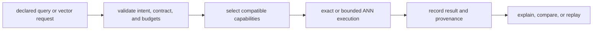

# Package Overview

`bijux-canon-index` executes vector retrieval under an explicit contract. A
request states its intent, determinism posture, limits, and backend needs; the
package selects a compatible execution path and records enough evidence to
explain or replay the result.

This is broader than a vector-store client and narrower than a reasoning
system. Index owns how retrieval runs, not what a retrieved passage means.

## Execution Model



A deterministic request can require an exact path. A non-deterministic request
must declare its randomness, replay posture, and bounds rather than inheriting
them invisibly from an adapter.

## What the Package Owns

| Surface | Responsibility |
| --- | --- |
| execution contracts | intent, deterministic or bounded mode, refusal posture, and resource budgets |
| artifacts | corpus and index identity used by execution requests |
| backend capabilities | availability and behavior of memory, SQLite, HNSW, FAISS, Qdrant, and excluded adapters |
| provenance | run metadata, status, results, explanations, and replay inputs |
| comparison | deterministic and approximate-result evaluation under named criteria |
| interfaces | module CLI and v1 HTTP operations over the same application boundary |

SQLite and in-memory resources provide local paths. Optional dependencies add
HNSW, FAISS, Qdrant, and YAML configuration support. The pgvector adapter is
currently an experimental v1 exclusion; its presence in the source tree is not
a stable production claim.

## Inspect Before Executing

The canonical wheel currently exposes a module CLI rather than a
`bijux-canon-index` console script:

```bash
python -m bijux_canon_index.interfaces.cli.app capabilities
```

Capability output reveals the selected backend, available adapters, and
supported execution contracts. Automation should inspect it rather than assume
that an optional native or service backend is installed.

## A Declared Request

```bash
python -m bijux_canon_index.interfaces.cli.app execute \
  --vector '[0.2, 0.8]' \
  --artifact-id corpus-retention \
  --execution-contract deterministic \
  --execution-intent exact_validation \
  --execution-mode strict \
  --top-k 5
```

The command validates the request, executes through a compatible backend, and
writes a run record. `--dry-run` renders a plan without retrieval; `--explain`
adds an explanation to the response. Non-deterministic execution adds explicit
seed, randomness-source, boundedness, and witness options.

## Public Boundaries

The package root intentionally exposes version metadata only. Import engine,
domain, or request types from their owning modules; undocumented root-level
re-exports are not a compatibility contract.

The supported interfaces are:

- `bijux_canon_index.application` for orchestration and execution engines;
- `bijux_canon_index.core` and `bijux_canon_index.domain` for contract types;
- `python -m bijux_canon_index.interfaces.cli.app` for command workflows;
- `bijux_canon_index.api.v1.app:app` for the FastAPI application.

## Ownership Boundary

Index accepts prepared material and returns retrieval evidence. It does not own
source cleaning, decide the truth of a claim, coordinate agent authority, or
approve a governed runtime run. Keeping those responsibilities outside the
package prevents backend behavior from becoming hidden application policy.

The `bijux-vex` compatibility distribution preserves its established import
and command surface while routing to this implementation. New integrations
should use the canonical module and consult
[compatibility commitments](../interfaces/compatibility-commitments.md).

Continue with [installation and setup](../operations/installation-and-setup.md)
or the [execution model](../architecture/execution-model.md).
