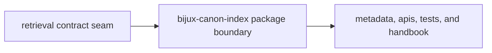

# Repository Fit

`bijux-canon-index` is a separate package because retrieval behavior creates its own contract pressure. Keeping that pressure visible at the package boundary prevents search semantics from becoming invisible infrastructure.

## Fit Model

This page should explain why retrieval is not just another backend detail in
the monorepo. The fit is real only when the package makes search semantics more
explicit, more publishable, and easier to defend.

## Why This Is A Package

- `packages/bijux-canon-index/src/bijux_canon_index` makes retrieval ownership visible in code
- `packages/bijux-canon-index/apis` shows where caller expectations harden into tracked surfaces
- `packages/bijux-canon-index/tests` proves replay and provenance claims against real behavior

## First Proof Check

- `packages/bijux-canon-index/pyproject.toml` for publishable package identity
- `packages/bijux-canon-index/README.md` for package-level reader framing
- `packages/bijux-canon-index/tests` for executable proof that the seam still matters

## Fit Warning

If the package only exists as a technical convenience for backend adapters, the retrieval seam is no longer being documented honestly.

## Design Pressure

If index is defended only as a technical layer for adapters, the repository has
already stopped documenting retrieval as a real contract surface.
