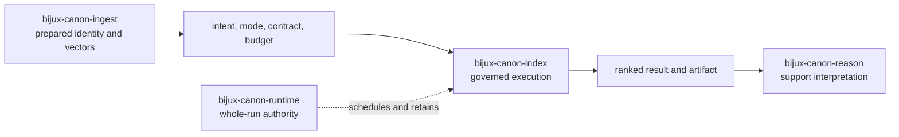
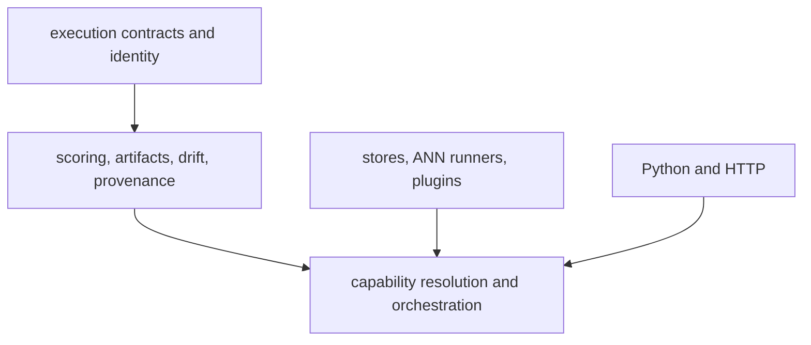

# Repository Fit

`bijux-canon-index` is independently installable because governed vector
execution is a durable boundary. It owns the decision that connects caller
intent to a capable backend, an ordered result, and the provenance required to
explain or compare that execution.

## Position In The Package Family

```mermaid
flowchart LR
    ingest["bijux-canon-ingest<br/>prepared identity and vectors"]
    request["intent, mode, contract, budget"]
    index["bijux-canon-index<br/>governed execution"]
    result["ranked result and artifact"]
    reason["bijux-canon-reason<br/>support interpretation"]
    runtime["bijux-canon-runtime<br/>whole-run authority"]

    ingest --> request --> index --> result --> reason
    runtime -. "schedules and retains" .-> index
```

Index does not normalize source text or decide that a neighbor supports a
claim. It establishes which operation actually ran and under which declared
contract. Runtime may schedule and retain that operation without replacing
index's capability and replay semantics.

## Independent Package Contract

| Surface | What independence provides |
| --- | --- |
| distribution | retrieval execution can be installed without the composed runtime |
| Python modules | execution requests, plans, artifacts, failures, and adapters have one implementation owner |
| narrow root facade | package identity stays stable without promoting internal modules accidentally |
| versioned HTTP contract | callers can execute and inspect index behavior across a process boundary |
| backend/plugin contracts | optional implementations conform to owned capability and evidence rules |
| persisted run evidence | artifacts, fingerprints, ledgers, and comparisons remain addressable |
| package tests | algorithms, stores, isolation, provenance, and replay evolve under conformance gates |

The canonical distribution publishes no console script. `bijux-vex` preserves
an earlier command through a compatibility package, but that continuity is not
the canonical architecture for new integrations.

## Dependency Direction

```mermaid
flowchart TD
    core["execution contracts and identity"]
    domain["scoring, artifacts, drift, provenance"]
    application["capability resolution and orchestration"]
    adapters["stores, ANN runners, plugins"]
    interfaces["Python and HTTP"]

    core --> domain --> application
    adapters --> application
    interfaces --> application
```

Adapters implement capabilities inward; they do not redefine exactness,
refusal, artifact identity, or replay policy. Product packages should exchange
typed handoffs rather than import each other's application internals.

## When This Boundary Would Be Wrong

The package would be only an adapter bucket if execution intent disappeared,
all backends defined their own result semantics, or artifacts could not explain
what ran. It would be overreaching if source preparation, claim verification,
or whole-run admission moved here. Both conditions require restoring the
contract boundary rather than adding another convenience layer.

Continue with [ownership boundary](ownership-boundary.md) for neighboring
responsibilities and [repository architecture](../../01-bijux-canon/foundation/package-map.md)
for the complete package family.
