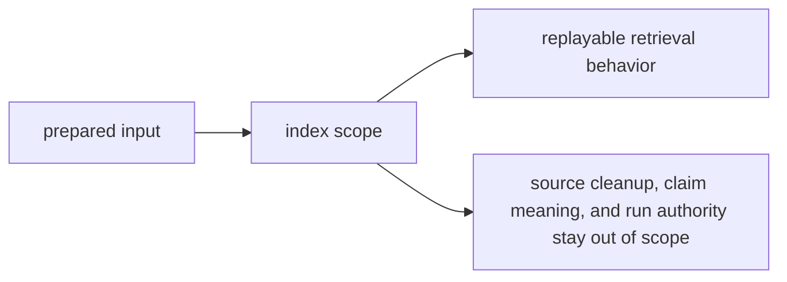

# Scope and Non-Goals

The scope of `bijux-canon-index` is to make search behavior explicit enough to defend. It is not a general home for “things that happen around retrieval.”

## Scope Map

This page should make index feel narrow in a useful way. It owns search
behavior end to end, but it should stop before explaining what results mean or
whether a whole run counts.

## In Scope

- vector execution and backend coordination tied to prepared ingest output
- replayable retrieval behavior and provenance-rich search results
- index-facing contracts that downstream reasoning and runtime flows rely on

## Non-Goals

- normalizing source material before search begins
- deciding what retrieved evidence means for a claim or verification step
- deciding whether a whole run is acceptable or durable under runtime policy

## Scope Check

If the change can only be explained by saying “search needs it somewhere,” the ownership argument is not strong enough yet.

## Design Pressure

If index starts collecting adjacent concerns just because they touch search, the
package turns into a traffic junction instead of a clear retrieval surface. The
non-goals keep the search contract reviewable.
