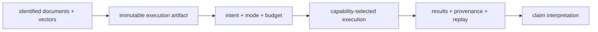

# Scope and Non-Goals

`bijux-canon-index` owns governed vector execution. Its scope begins when
documents and vectors have stable identity and ends with ordered retrieval
results whose request, artifact, backend, cost, provenance, and replay posture
are recorded.

```mermaid
flowchart LR
    prepared["identified documents + vectors"]
    artifact["immutable execution artifact"]
    contract["intent + mode + budget"]
    backend["capability-selected execution"]
    result["results + provenance + replay"]
    interpretation["claim interpretation"]

    prepared --> artifact --> contract --> backend --> result --> interpretation
```

## In scope

- deterministic and non-deterministic execution contracts, intent, mode,
  budgets, metrics, result counts, and randomness policy;
- immutable artifact materialization over ordered vectors, corpus identity,
  scoring version, construction parameters, and index configuration;
- backend and plugin capability discovery, selection, registration, and
  conformance;
- exact scoring, stable tie ordering, bounded ANN candidate execution,
  optional exact rescoring, witnesses, and approximation evidence;
- execution identities, fingerprints, cost, run lifecycle, explanation,
  comparison, drift, and replay;
- local ledger, file-backed run records, vector-store adapters, CLI module,
  HTTP v1, and strict schema boundaries.

## Non-goals

| Not owned here | Owning boundary |
| --- | --- |
| Source parsing, normalization, chunk semantics, or original-text mapping | `bijux-canon-ingest` |
| Embedding model fitness for a scientific or business domain | model evaluation supplied by the caller |
| Whether retrieved evidence supports a claim | `bijux-canon-reason` |
| Role order, convergence, or agent lifecycle | `bijux-canon-agent` |
| End-to-end flow acceptance, tenant authority, or workflow replay | `bijux-canon-runtime` |
| Authentication, transport security, distributed locks, or backend credential policy | deploying system |
| Identical results across exact and approximate backends | no such contract; divergence must remain explicit |

## Supported-surface boundary

The source tree includes adapters and plugin examples whose presence exceeds
the v1 support contract. Remote backends, asynchronous orchestration, and
streaming search are excluded from v1. The pgvector adapter is experimental
and outside the v1 freeze. Capability discovery and conformance establish
availability; imports alone do not.

## Scope test

A change belongs here when it alters what vector execution was authorized,
which backend could satisfy it, how results were ranked, or what evidence is
required to explain and replay that operation. It does not belong here when it
changes source representation or interprets a retrieved span as a supported
conclusion.

An `ExecutionArtifact` proves an execution context, not corpus completeness,
semantic relevance, or truth. See the [capability map](capability-map.md) for
implemented authority and [known limitations](../quality/known-limitations.md)
for backend, quality, budget, persistence, and security boundaries.
