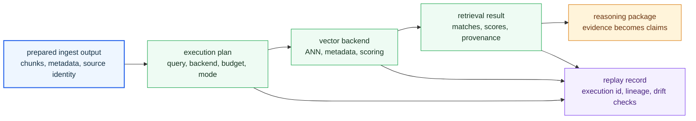

# Index Handbook

`bijux-canon-index` owns vector execution, provenance-aware retrieval, and replayable index behavior. It turns prepared ingest output into retrieval surfaces that downstream packages can inspect and reuse without guessing how search happened.

The main failure this handbook prevents is smearing retrieval concerns across ingest, reasoning, and runtime. If vector execution and replay behavior are not owned explicitly here, every later layer starts making hidden assumptions about how evidence was found.

## What The Reader Should See First

Index is the retrieval accountability layer. It accepts prepared material,
executes search through declared vector and query contracts, and hands forward
results that carry enough provenance for another package to explain why a piece
of evidence was returned.

## What This Package Owns

- embedding and vector-store execution tied to prepared ingest output
- retrieval behavior that stays provenance-aware and replayable under review
- index-facing contracts and artifacts that downstream packages rely on during search

## What This Package Does Not Own

- source preparation and chunk shaping before indexing begins
- claim interpretation, reasoning policy, or reviewer-facing verification semantics
- top-level runtime authority above retrieval execution and trace collection

## Boundary Test

If the disputed behavior decides what gets embedded, stored, retrieved, compared, or replayed during search, it belongs here. If it decides what a claim means or whether a run is acceptable to keep, it does not.

## First Proof Check

- `packages/bijux-canon-index/src/bijux_canon_index` for the owned retrieval implementation boundary
- `apis/bijux-canon-index/v1/schema.yaml` for the tracked caller-facing schema
- `packages/bijux-canon-index/src/bijux_canon_index/domain/provenance` for audit, replay, and lineage behavior
- `packages/bijux-canon-index/tests` for replay, provenance, and retrieval correctness evidence

## Start Here

- open [Foundation](https://bijux.io/bijux-canon/03-bijux-canon-index/foundation/) when the question is why this package exists or where its ownership stops
- open [Architecture](https://bijux.io/bijux-canon/03-bijux-canon-index/architecture/) when you need module boundaries, dependency flow, or execution shape
- open [Interfaces](https://bijux.io/bijux-canon/03-bijux-canon-index/interfaces/) when the question is about commands, APIs, schemas, imports, or artifacts that callers may treat as stable
- open [Operations](https://bijux.io/bijux-canon/03-bijux-canon-index/operations/) when you need local workflow, diagnostics, release, or recovery guidance
- open [Quality](https://bijux.io/bijux-canon/03-bijux-canon-index/quality/) when the question is whether the package has proved its promises strongly enough

## Pages In This Package

- [Foundation](https://bijux.io/bijux-canon/03-bijux-canon-index/foundation/)
- [Architecture](https://bijux.io/bijux-canon/03-bijux-canon-index/architecture/)
- [Interfaces](https://bijux.io/bijux-canon/03-bijux-canon-index/interfaces/)
- [Operations](https://bijux.io/bijux-canon/03-bijux-canon-index/operations/)
- [Quality](https://bijux.io/bijux-canon/03-bijux-canon-index/quality/)

## Bottom Line

If a proposed change makes `bijux-canon-index` broader without making its owned role easier to defend, the change is probably crossing a package boundary rather than improving the design.
