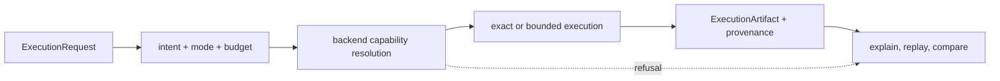
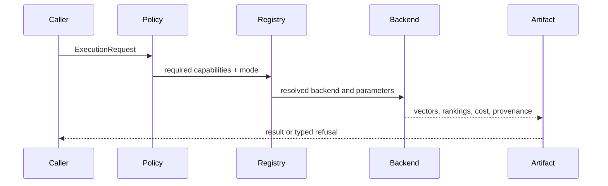

# Index Handbook

`bijux-canon-index` executes vector work under an explicit contract. A request
declares its intent, execution mode, determinism posture, budget, artifact
identity, and backend requirements before the engine selects resources. The
result records provenance and cost rather than returning an unexplained list of
neighbors.

Deterministic execution is the supported baseline. Non-deterministic execution
is bounded by declared randomness, approximation, witness, memory, latency, and
replay policies; it is never presented as bitwise-equivalent exact search.

```mermaid
flowchart LR
    request["ExecutionRequest"]
    policy["intent + mode + budget"]
    capabilities["backend capability resolution"]
    execution["exact or bounded execution"]
    artifact["ExecutionArtifact + provenance"]
    review["explain, replay, compare"]

    request --> policy --> capabilities --> execution --> artifact --> review
    capabilities -. refusal .-> review
```

## Execution Vocabulary

| Declaration | Values | Why it is recorded |
| --- | --- | --- |
| intent | exact validation, reproducible research, exploratory search, production retrieval | explains why loss or nondeterminism is acceptable |
| mode | strict, bounded, exploratory | selects refusal and tolerance behavior |
| contract | deterministic, non-deterministic | establishes the replay claim that may be made |
| budget | latency, memory, error, and approximation bounds | turns resource use into an input rather than an accident |
| identity | artifact, run, correlation, backend, index, and parameter identities | makes execution and comparison addressable |

## Public Surfaces

- the Typer application exposes workspace initialization, capabilities, ingest,
  execute, explain, replay, compare, validation, diagnostics, artifacts, run
  listing, vector-store utilities, and non-deterministic performance commands
- the HTTP API exposes create, ingest, execute, explain, replay, artifact,
  artifact listing, run listing, and backend capabilities operations
- plugin packages demonstrate a remote backend, a sentence-transformers
  provider, and a reusable backend template
- the package root currently exports only `__version__`; callers use the
  domain, application, contract, and interface modules deliberately

## Follow One Vector Execution

```mermaid
sequenceDiagram
    participant Caller
    participant Policy
    participant Registry
    participant Backend
    participant Artifact

    Caller->>Policy: ExecutionRequest
    Policy->>Registry: required capabilities + mode
    Registry->>Backend: resolved backend and parameters
    Backend-->>Artifact: vectors, rankings, cost, provenance
    Artifact-->>Caller: result or typed refusal
```

| Boundary | Evidence retained | Review question |
| --- | --- | --- |
| request | intent, mode, contract, budget, identities, parameters | what was the caller actually asking the engine to guarantee? |
| resolution | backend registration and capability profile | why was this backend eligible? |
| execution | normalized vectors, metric, limits, seed or declared variance | which choices can change ranking or reproducibility? |
| result | artifact identity, results, provenance, cost, warnings | can the output be tied to the request and backend that produced it? |
| comparison | original and replay artifacts plus tolerance policy | is the difference exact, acceptable, unexplained, or refused? |

Inspect capabilities before execution. The
[entrypoint examples](interfaces/entrypoints-and-examples.md) demonstrate both
strict deterministic work and honestly declared approximate work.

## Retrieval Trust Boundary

Index begins after source material has a stable prepared identity. It does not
repair chunking or normalization, and it does not interpret a retrieved span as
a supported claim. Its authority is the vector operation between those
boundaries: embedding/provider selection, backend capability negotiation,
index identity, metric semantics, budgets, ranking, execution provenance, and
replay comparison.

An `ExecutionArtifact` establishes what the engine did under a declared
contract. It does not establish corpus completeness, semantic relevance, or
truth. Those stronger questions require source evidence and reasoning-level
verification.

## Evidence And Limits

| Claim | Evidence to inspect | Limit |
| --- | --- | --- |
| execution was exact | strict mode, exact-capable backend, metric and parameter identity, artifact provenance | numerical implementation differences may still require comparison |
| approximation stayed bounded | declared error and resource bounds, backend witness, observed metrics | a bound is not a guarantee outside the measured contract |
| replay is acceptable | original request and artifact, current capabilities, diff, tolerance policy | similar neighbors alone are insufficient |
| a plugin is compatible | registry contract, capability declaration, conformance results | registration does not make the backend trustworthy |
| a ranking is reviewable | query and corpus identity, scores, metric, backend, artifact lineage | does not prove relevance or factual support |

## Continue By Question

| Question | Next page |
| --- | --- |
| where does vector authority start and stop? | [Foundation](foundation/index.md) |
| how do domain, application, registry, and adapters depend on one another? | [Architecture](architecture/index.md) |
| which Python, CLI, HTTP, plugin, and artifact contracts are callable? | [Interfaces](interfaces/index.md) |
| how do I configure, operate, inspect, or recover execution? | [Operations](operations/index.md) |
| which tests defend exactness, provenance, replay, and plugins? | [Quality](quality/index.md) |

## Refusal Is A Result

Backend unavailability, missing capabilities, invalid vectors, budget
violations, corrupt artifacts, backend divergence, and unsupported replay have
distinct error types. Strict mode refuses work that cannot satisfy its declared
contract. Bounded and exploratory modes may permit approximation only when the
request records the corresponding limits and intent.
