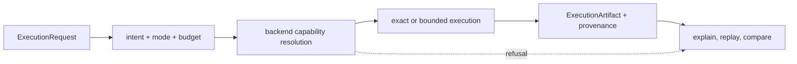

# Index Handbook

`bijux-canon-index` executes vector work under an explicit contract. A request
declares its intent, execution mode, determinism posture, budget, artifact
identity, and backend requirements before the engine selects resources. The
result records provenance and cost rather than returning an unexplained list of
neighbors.

Deterministic execution is the supported baseline. Non-deterministic execution
is bounded by declared randomness, approximation, witness, memory, latency, and
replay policies; it is never presented as bitwise-equivalent exact search.

```mermaid
flowchart LR
    request["ExecutionRequest"]
    policy["intent + mode + budget"]
    capabilities["backend capability resolution"]
    execution["exact or bounded execution"]
    artifact["ExecutionArtifact + provenance"]
    review["explain, replay, compare"]

    request --> policy --> capabilities --> execution --> artifact --> review
    capabilities -. refusal .-> review
```

## Execution Vocabulary

| Declaration | Values | Why it is recorded |
| --- | --- | --- |
| intent | exact validation, reproducible research, exploratory search, production retrieval | explains why loss or nondeterminism is acceptable |
| mode | strict, bounded, exploratory | selects refusal and tolerance behavior |
| contract | deterministic, non-deterministic | establishes the replay claim that may be made |
| budget | latency, memory, error, and approximation bounds | turns resource use into an input rather than an accident |
| identity | artifact, run, correlation, backend, index, and parameter identities | makes execution and comparison addressable |

## Public Surfaces

- the Typer application exposes workspace initialization, capabilities, ingest,
  execute, explain, replay, compare, validation, diagnostics, artifacts, run
  listing, vector-store utilities, and non-deterministic performance commands
- the HTTP API exposes create, ingest, execute, explain, replay, artifact,
  artifact listing, run listing, and backend capabilities operations
- plugin packages demonstrate a remote backend, a sentence-transformers
  provider, and a reusable backend template
- the package root currently exports only `__version__`; callers use the
  domain, application, contract, and interface modules deliberately

## What This Package Owns

- embedding and vector-store execution tied to prepared ingest output
- retrieval behavior that stays provenance-aware and replayable under review
- index-facing contracts and artifacts that downstream packages rely on during search

## What This Package Does Not Own

- source preparation and chunk shaping before indexing begins
- claim interpretation, reasoning policy, or reviewer-facing verification semantics
- top-level runtime authority above retrieval execution and trace collection

## Ownership Test

If the disputed behavior decides what gets embedded, stored, retrieved,
compared, or replayed during search, it belongs here. If it decides what a
claim means or whether a run is acceptable to keep, it does not.

## Implementation Anchors

- `packages/bijux-canon-index/src/bijux_canon_index` for the owned retrieval implementation boundary
- `apis/bijux-canon-index/v1/schema.yaml` for the tracked caller-facing schema
- `packages/bijux-canon-index/src/bijux_canon_index/domain/provenance` for audit, replay, and lineage behavior
- `packages/bijux-canon-index/tests` for replay, provenance, and retrieval correctness evidence

## Start Here

- open [Foundation](https://bijux.io/bijux-canon/03-bijux-canon-index/foundation/) when the question is why this package exists or where its ownership stops
- open [Architecture](https://bijux.io/bijux-canon/03-bijux-canon-index/architecture/) when you need module boundaries, dependency flow, or execution shape
- open [Interfaces](https://bijux.io/bijux-canon/03-bijux-canon-index/interfaces/) when the question is about commands, APIs, schemas, imports, or artifacts that callers may treat as stable
- open [Operations](https://bijux.io/bijux-canon/03-bijux-canon-index/operations/) when you need local workflow, diagnostics, release, or recovery guidance
- open [Quality](https://bijux.io/bijux-canon/03-bijux-canon-index/quality/) when the question is whether the package has proved its promises strongly enough

## Reference Areas

- [Foundation](https://bijux.io/bijux-canon/03-bijux-canon-index/foundation/)
- [Architecture](https://bijux.io/bijux-canon/03-bijux-canon-index/architecture/)
- [Interfaces](https://bijux.io/bijux-canon/03-bijux-canon-index/interfaces/)
- [Operations](https://bijux.io/bijux-canon/03-bijux-canon-index/operations/)
- [Quality](https://bijux.io/bijux-canon/03-bijux-canon-index/quality/)

## Refusal Is A Result

Backend unavailability, missing capabilities, invalid vectors, budget
violations, corrupt artifacts, backend divergence, and unsupported replay have
distinct error types. Strict mode refuses work that cannot satisfy its declared
contract. Bounded and exploratory modes may permit approximation only when the
request records the corresponding limits and intent.
