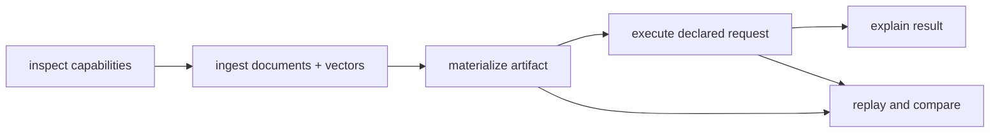

# HTTP API

The index HTTP API exposes capability discovery, corpus and artifact
materialization, contract-driven vector execution, explanation, and replay.
The FastAPI application is published as
`bijux_canon_index.api.v1.app:app`.

## Operation Map

| Method and path | Purpose | Evidence returned |
| --- | --- | --- |
| `GET /capabilities` | describe the active engine and registered integrations | contracts, modes, metrics, ANN state, vector stores, plugins, limits |
| `POST /create` | reserve a logical corpus name | name and creation status |
| `POST /ingest` | store documents with supplied or provider-generated vectors | ingest count and correlation identity |
| `POST /artifact` | freeze executable vector state under a declared contract | artifact identity, contract status, replayability |
| `POST /execute` | run an exact or bounded vector request | results, execution identity, contract status, replay metadata |
| `POST /explain` | trace a result to its document, chunk, vector, artifact, metric, and score | provenance envelope |
| `POST /replay` | compare execution under retained artifact and variance policy | fingerprints, match decision, difference details, nondeterministic sources |
| `GET /artifacts` | list known execution artifacts | paginated artifact identities |
| `GET /runs` | list recorded executions | paginated run identities |


```mermaid
flowchart LR
    capabilities[inspect capabilities]
    ingest[ingest documents + vectors]
    artifact[materialize artifact]
    execute[execute declared request]
    explain[explain result]
    replay[replay and compare]

    capabilities --> ingest --> artifact --> execute
    execute --> explain
    artifact --> replay
    execute --> replay
```

## Execute Only After Discovery

```bash
curl --fail-with-body http://127.0.0.1:8000/capabilities

curl --fail-with-body http://127.0.0.1:8000/execute \
  --header 'content-type: application/json' \
  --header 'X-Correlation-Id: review-17' \
  --data '{
    "artifact_id": "art-1",
    "vector": [0.2, 0.8],
    "top_k": 3,
    "execution_contract": "deterministic",
    "execution_intent": "exact_validation",
    "execution_mode": "strict"
  }'
```

Capability discovery is part of the contract, not a diagnostic afterthought.
Strict execution refuses a request when the selected backend cannot satisfy
its declared contract.

## Identity And Idempotency

`X-Correlation-Id` is accepted across operations and echoed where the route
produces a response header. Payload correlation identity is used when a header
is absent. `POST /ingest` also accepts `Idempotency-Key`; a payload value takes
precedence when both are present.

Persist correlation, artifact, execution, backend, index, and parameter
identities with every result. A score without those identities cannot support
explanation or replay.

## Validation And Refusal

- Request models are strict: unknown or malformed fields fail validation.
- Ingest requires one vector per document, or an embedding model when vectors
  are omitted.
- Execute requires `request_text` or `vector`, a positive `top_k`, an explicit
  execution contract and intent, and a valid mode.
- Non-deterministic execution must declare the randomness and approximation
  posture required by its mode.
- Known domain refusals map to a 4xx response whose `detail.error` includes a
  reason, message, and remediation; correlation identity is retained when
  supplied.
- Request-model validation returns `422`. Unexpected implementation failures
  return `500` without exposing internal details.

Refusal is a valid governed outcome. Clients must not translate it into an
empty result set or silently retry under a weaker contract.

## Backend And Security Boundary

Storage and execution state depend on the selected vector-store backend, URI,
options, embedding provider, and cache. Those fields are part of the request
contract; changing them can change artifact identity and replayability. List
operations report state known to the configured stores, not a distributed
inventory across arbitrary deployments.

The application does not establish authentication, tenant isolation, provider
credential policy, or network sandboxing. Put those controls at the deployment
boundary and never accept untrusted plugin or backend configuration merely
because its payload validates.

## Contract Authority

The versioned schema is
[`apis/bijux-canon-index/v1/schema.yaml`](https://github.com/bijux/bijux-canon/blob/main/apis/bijux-canon-index/v1/schema.yaml),
with its pin and hash. Route implementations and live contract tests establish
which schema operations execute. See [Data Contracts](data-contracts.md) for
payload ownership and [Artifact Contracts](artifact-contracts.md) for retained
execution evidence.
