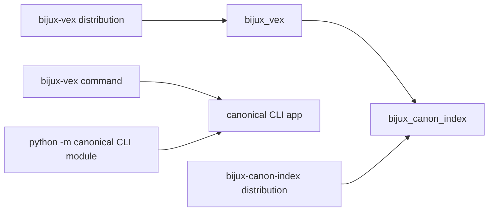
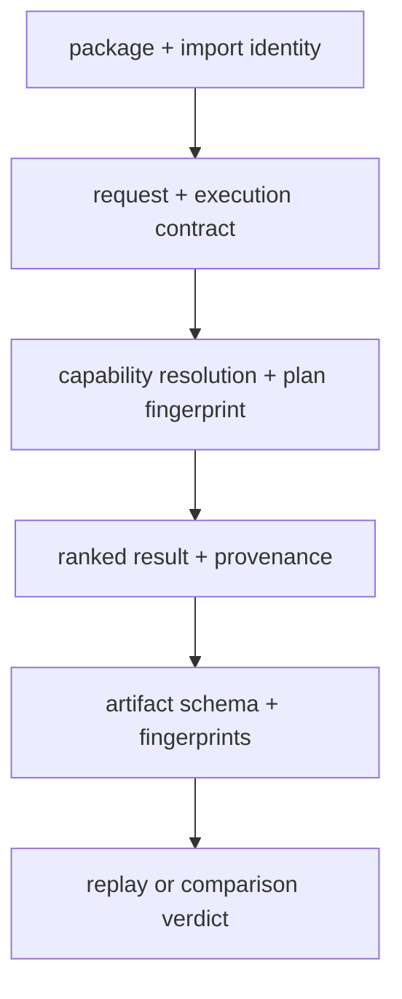

# Compatibility Commitments

The canonical distribution and import are `bijux-canon-index` and
`bijux_canon_index`. The canonical wheel currently exposes its CLI through the
module entry point:

```bash
python -m bijux_canon_index.interfaces.cli.app capabilities
```

It does not register a `bijux-canon-index` console command. Automation should
use the module form instead of depending on an executable that is not packaged.

## Legacy Name

`bijux-vex` is a synchronized compatibility distribution. It preserves the
`bijux_vex` import and registers the legacy `bijux-vex` command, which invokes
the canonical CLI application.



The alias installs runtime submodule aliases and forwards root attributes,
`__all__`, and interactive discovery. Because the canonical root intentionally
exports only `__version__`, application types should still be imported from
their documented owning namespaces under either package name.

## Compatibility Has Independent Axes

| Axis | Protected surface | Required evidence |
| --- | --- | --- |
| packaging | synchronized `bijux-vex` dependency on `bijux-canon-index` | resolved metadata at one release |
| Python | canonical root and nested module/class identity | import and object-identity checks |
| command | preserved `bijux-vex` versus canonical module CLI | operation, arguments, structured output, and exit status |
| domain | requests, budgets, contracts, plans, sessions, results | invariant and execution-ABI coverage |
| wire | v1 HTTP schemas and error/status semantics | OpenAPI pin, schema diff, and route contracts |
| artifacts | schema/version fields, fingerprints, run-file meaning | reader validation and portability tests |
| retrieval | capability decision, ranking, scores, provenance | fixed-corpus exact or bounded comparison |
| replay | original identity, current state, tolerance, and verdict | replay/compare evidence rather than result resemblance |



An earlier layer passing cannot substitute for a later one. The same class
identity does not guarantee the same backend state, ranking, or replay verdict.

## Contract Boundaries

Name compatibility does not override data compatibility. The following surfaces
have independent change rules:

- the v1 OpenAPI request and response schemas;
- execution artifact schema and artifact versions;
- run-directory file meanings and replay equivalence;
- fingerprint inputs, ranking semantics, and backend capabilities; and
- enums that govern contract, intent, mode, lifecycle, and refusal behavior.

A compatibility alias cannot load an unsupported artifact version or turn a
non-replayable run into a replayable one.

## Changes And Their Obligations

| Change | Compatibility obligation |
| --- | --- |
| add an export to a documented facade | preserve existing exports and extend facade/API inventory tests |
| remove or change a documented model, enum, or invariant | provide an explicit migration and version decision |
| change HTTP fields or status semantics | update and review the OpenAPI contract |
| change fingerprint inputs or execution ABI | surface the identity change and invalidate false equivalence |
| change exact ranking semantics | compare deterministic ordered results and provenance |
| change approximate behavior | retain profile, randomness, bounds, witness evidence, and declared tolerance |
| reorganize an undocumented adapter or orchestration module | internal unless a documented facade or observable contract changes |

## Migration

New integrations should depend on `bijux-canon-index`, import
`bijux_canon_index`, and invoke the canonical module CLI. Existing consumers can
migrate these surfaces independently:

1. change the installed distribution;
2. replace `bijux_vex` imports;
3. inventory plugins, dynamic imports, serialized dotted paths, artifact
   readers, configuration, and container entrypoints;
4. replace each `bijux-vex` command with the documented Python facade,
   canonical module CLI, or versioned HTTP API;
5. replay a fixed execution and compare fingerprints, result order, scores,
   provenance, typed failures, and declared equivalence; and
6. remove the bridge only after deployed consumers no longer require its
   distribution, import root, or executable.

## Migration Acceptance

For exact execution, retain identical governed inputs, capability selection,
plan and artifact fingerprints, ordered results, and an exact replay verdict.
For approximate execution, retain the ANN profile, randomness declaration,
quality evidence, observed differences, and tolerance decision. Similar
neighbors without those identities are not compatibility proof.

The canonical distribution deliberately has no console script. Migration is
therefore complete only when every old command caller has selected and tested
an actual canonical boundary; renaming the executable is not an option.

See the [bijux-vex catalog entry](../../08-compat-packages/catalog/bijux-vex.md)
for package-level details.
