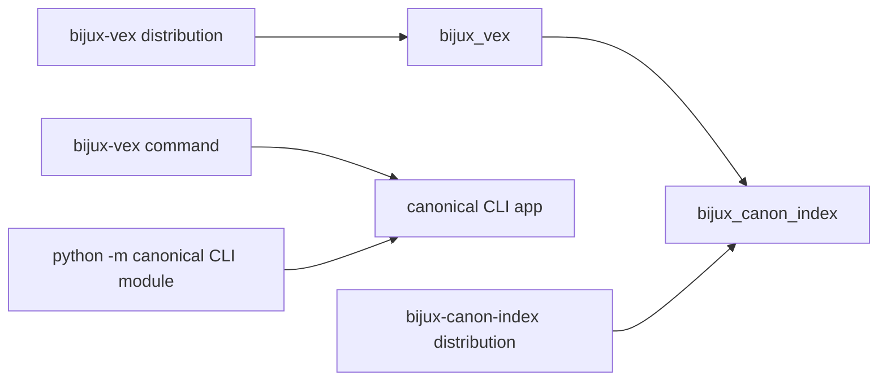

# Compatibility Commitments

The canonical distribution and import are `bijux-canon-index` and
`bijux_canon_index`. The canonical wheel currently exposes its CLI through the
module entry point:

```bash
python -m bijux_canon_index.interfaces.cli.app capabilities
```

It does not register a `bijux-canon-index` console command. Automation should
use the module form instead of depending on an executable that is not packaged.

## Legacy Name

`bijux-vex` is a synchronized compatibility distribution. It preserves the
`bijux_vex` import and registers the legacy `bijux-vex` command, which invokes
the canonical CLI application.



The alias installs runtime submodule aliases and forwards root attributes,
`__all__`, and interactive discovery. Because the canonical root intentionally
exports only `__version__`, application types should still be imported from
their documented owning namespaces under either package name.

## Contract Boundaries

Name compatibility does not override data compatibility. The following surfaces
have independent change rules:

- the v1 OpenAPI request and response schemas;
- execution artifact schema and artifact versions;
- run-directory file meanings and replay equivalence;
- fingerprint inputs, ranking semantics, and backend capabilities; and
- enums that govern contract, intent, mode, lifecycle, and refusal behavior.

A compatibility alias cannot load an unsupported artifact version or turn a
non-replayable run into a replayable one.

## Migration

New integrations should depend on `bijux-canon-index`, import
`bijux_canon_index`, and invoke the canonical module CLI. Existing consumers can
migrate these surfaces independently:

1. change the installed distribution;
2. replace `bijux_vex` imports;
3. replace `bijux-vex` commands with the canonical module invocation; and
4. replay a fixed execution and compare fingerprints, result order, and
   declared equivalence.

See the [bijux-vex catalog entry](../../08-compat-packages/catalog/bijux-vex.md)
for package-level details.
