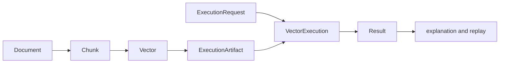

# Data Contracts

Index separates corpus data, execution policy, and result evidence. That
separation is deliberate: a vector says what can be searched, an execution
request says what guarantees are required, and a result says what a particular
run returned.

## Corpus Primitives

| Type | Stable meaning |
| --- | --- |
| `Document` | source identity, text, optional source and version |
| `Chunk` | document-owned text span with ordinal and optional offsets |
| `Vector` | vector identity, chunk identity, values, declared dimension, model, metadata |
| `ModelSpec` | model identity, dimension, vendor, and version |

`Vector` freezes values as a tuple, requires a positive dimension, and rejects
a value count that differs from the declared dimension. Metadata is normalized
to string pairs. These checks make dimension and identity failures visible
before backend execution.

## Execution Request

`ExecutionRequest` requires a request ID, query text or vector, `top_k`, an
`ExecutionContract`, and an `ExecutionIntent`. Its contract and mode must agree:

- deterministic execution requires `strict` mode and forbids non-deterministic
  settings;
- non-deterministic execution requires `bounded` or `exploratory` mode and an
  explicit budget; and
- ANN quality settings validate ranges, candidate counts, witness policy,
  memory limits, and distance space before planning.

`ExecutionBudget` makes latency, memory, error, vector-count, distance, and ANN
probe limits part of the request. `NDSettings` makes approximation policy part
of the request. Neither should be reconstructed from logs after execution.

## Boundary Payloads

HTTP payloads use strict Pydantic models rather than accepting core dataclasses
directly. Unknown fields are rejected. Important request rules include:

- ingest accepts either vectors aligned one-for-one with documents or an
  embedding model;
- execute requires query text or a vector and requires `top_k > 0`;
- non-deterministic execute requests must declare valid randomness and budget
  policy; and
- artifact materialization accepts only `exact` or `ann` as an index mode.

Responses preserve ordered vector identifiers and the identity needed to audit
them. Execute, explain, and replay responses carry the execution contract,
status, replayability, and execution ID. Replay additionally returns original
and replay fingerprints, mismatch details, and non-deterministic sources.

## Core Result Versus API Result

The core `Result` is a scored retrieval row with document, chunk, vector,
artifact, score, and rank. `ExecuteResponse.results` is an ordered list of
vector IDs designed for the HTTP boundary. Consumers that require scores or
lineage should request explanation evidence instead of assuming the compact API
response contains the full internal row.

Changing identity meaning, dimension validation, execution-mode rules, score
semantics, ordering, or replay fields is compatibility-sensitive. See
[Artifact Contracts](artifact-contracts.md) for persisted execution evidence.
