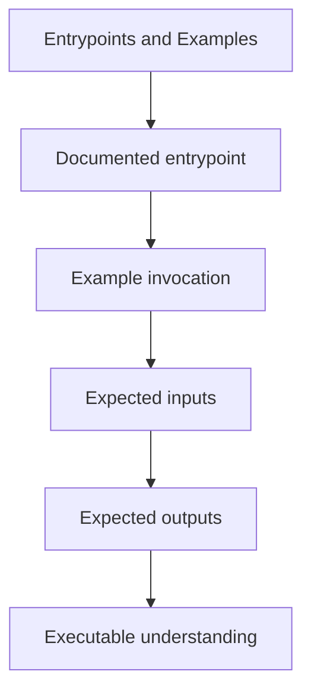

# Entrypoints and Examples

The fastest way to understand the package interfaces is to pair entrypoints
with concrete examples.

Examples are doing real work here. They let an impatient reader test whether the
package story is credible without reconstructing usage from source alone.

Treat the interfaces pages for `bijux-canon-index` as the bridge between implementation detail and caller expectation. They should show what the package is prepared to defend before a dependency forms.

## Visual Summary

## Entrypoints

- CLI modules under src/bijux_canon_index/interfaces/cli
- HTTP app under src/bijux_canon_index/api
- OpenAPI schema files under apis/bijux-canon-index/v1

## Example Anchors

- tests/e2e and tests/scenarios as executable usage guides
- apis/bijux-canon-index/v1/pinned_openapi.json for HTTP contract shape

## Concrete Anchors

- CLI modules under src/bijux_canon_index/interfaces/cli
- HTTP app under src/bijux_canon_index/api
- OpenAPI schema files under apis/bijux-canon-index/v1
- apis/bijux-canon-index/v1/schema.yaml

## Use This Page When

- you need the public command, API, import, schema, or artifact surface
- you are checking whether a caller can safely rely on a given entrypoint or shape
- you want the contract-facing side of the package before building on it

## Decision Rule

Use `Entrypoints and Examples` to decide whether a caller-facing surface is explicit enough to depend on. If the surface cannot be tied back to concrete code, schemas, artifacts, examples, and tests, treat it as unstable until that evidence is visible.

## What This Page Answers

- which public or operator-facing surfaces `bijux-canon-index` is really asking readers to trust
- which schemas, artifacts, imports, or commands behave like contracts
- what compatibility pressure a change to this surface would create

## Reviewer Lens

- compare commands, schemas, imports, and artifacts against the documented surface one by one
- check whether a seemingly local change actually needs compatibility review
- confirm that examples still point to real entrypoints and not to stale habits

## Honesty Boundary

This page can identify the intended public surfaces of `bijux-canon-index`, but real compatibility depends on code, schemas, artifacts, examples, and tests staying aligned. If those disagree, the prose is wrong or incomplete.

## Next Checks

- move to operations when the caller-facing question becomes procedural or environmental
- move to quality when compatibility or evidence of protection becomes the real issue
- move back to architecture when a public-surface question reveals a deeper structural drift

## Purpose

This page records where maintainers can find real invocation examples instead of inventing them from scratch.

## Stability

Keep it aligned with the checked-in examples, fixtures, and executable tests.
