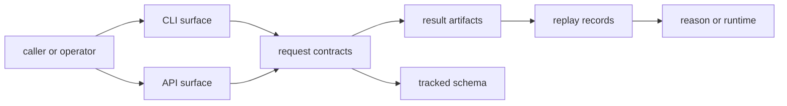

# Interfaces

Open this section when the question is contractual: which index commands, APIs, retrieval outputs, artifacts, and imports callers may treat as stable enough to build on.

## Contract Surface

Index contracts sit between prepared data and evidence consumers. They include
operator commands, HTTP routes, query payloads, execution artifacts, and replay
records. The page should make clear which surfaces are stable promises and
which backend details remain internal.

The interface story for index is really a retrieval accountability story.
Callers need to know not only how to submit a query, but also what result,
artifact, and replay surface they are allowed to depend on after the query
finishes.

## Read These First

- open [API Surface](https://bijux.io/bijux-canon/03-bijux-canon-index/interfaces/api-surface/) first when the contract question begins with a caller-visible schema or HTTP surface
- open [Data Contracts](https://bijux.io/bijux-canon/03-bijux-canon-index/interfaces/data-contracts/) when the dispute is about retrieval payloads or replay-visible record shape
- open [Compatibility Commitments](https://bijux.io/bijux-canon/03-bijux-canon-index/interfaces/compatibility-commitments/) when search-surface changes may break downstream expectations

## Contract Risk

The main contract risk here is treating retrieval behavior as backend detail while callers quietly harden dependencies against it.

## First Proof Check

- `packages/bijux-canon-index/src/bijux_canon_index/interfaces` for CLI, schema, and error surfaces
- `packages/bijux-canon-index/src/bijux_canon_index/api/v1` for HTTP routes and runtime app boundaries
- `apis/bijux-canon-index/v1/schema.yaml` for tracked schema visibility
- `packages/bijux-canon-index/tests` for replay, provenance, and compatibility evidence

## Pages In This Section

- [CLI Surface](https://bijux.io/bijux-canon/03-bijux-canon-index/interfaces/cli-surface/)
- [API Surface](https://bijux.io/bijux-canon/03-bijux-canon-index/interfaces/api-surface/)
- [Configuration Surface](https://bijux.io/bijux-canon/03-bijux-canon-index/interfaces/configuration-surface/)
- [Data Contracts](https://bijux.io/bijux-canon/03-bijux-canon-index/interfaces/data-contracts/)
- [Artifact Contracts](https://bijux.io/bijux-canon/03-bijux-canon-index/interfaces/artifact-contracts/)
- [Entrypoints and Examples](https://bijux.io/bijux-canon/03-bijux-canon-index/interfaces/entrypoints-and-examples/)
- [Operator Workflows](https://bijux.io/bijux-canon/03-bijux-canon-index/interfaces/operator-workflows/)
- [Public Imports](https://bijux.io/bijux-canon/03-bijux-canon-index/interfaces/public-imports/)
- [Compatibility Commitments](https://bijux.io/bijux-canon/03-bijux-canon-index/interfaces/compatibility-commitments/)

## Leave This Section When

- leave for [Foundation](https://bijux.io/bijux-canon/03-bijux-canon-index/foundation/) when the contract dispute is really a package-boundary dispute
- leave for [Architecture](https://bijux.io/bijux-canon/03-bijux-canon-index/architecture/) when a surface question reveals structural drift underneath it
- leave for [Operations](https://bijux.io/bijux-canon/03-bijux-canon-index/operations/) or [Quality](https://bijux.io/bijux-canon/03-bijux-canon-index/quality/) when the boundary is clear and the question becomes execution or proof

## Design Pressure

If a replay-visible behavior is treated as an implementation detail here,
downstream packages will still depend on it but without an explicit contract.
The interface page should make those dependencies visible before they become
surprises.
